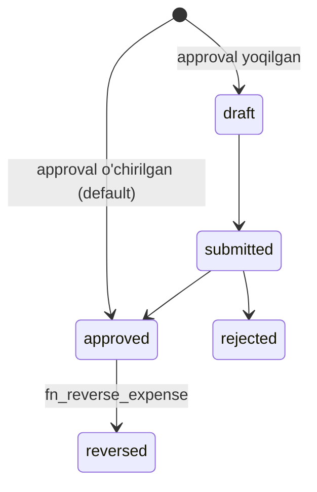
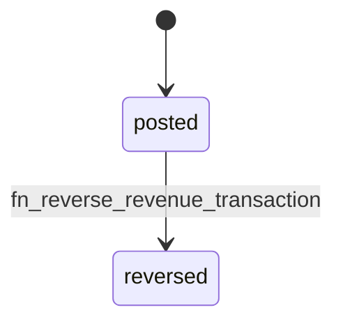
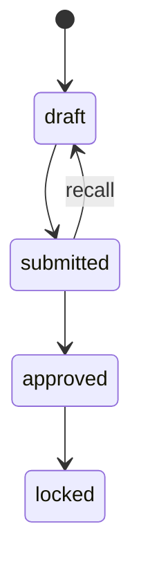
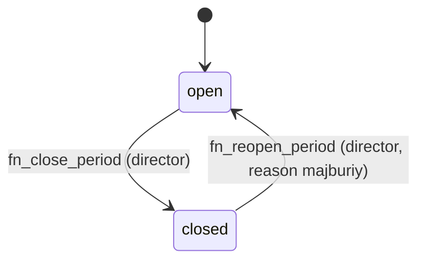
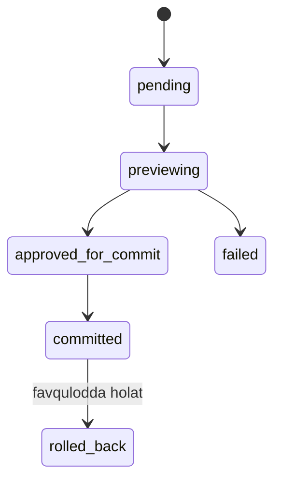
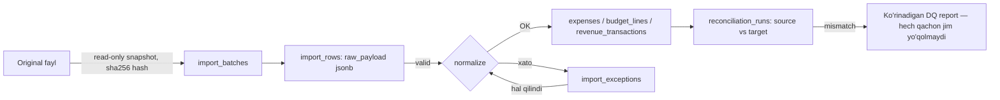

# FINCORE — Ma'lumotlar bazasi arxitekturasi (V1)

**Versiya:** 1.1
**Sana:** 2026-08-20 (dastlabki), yangilangan 2026-08-21 — Break-even scope qo'shildi (§2, §3 band 12, §8, §19.1)
**Manba TZ:** `docs/PLATFORM_TZ_FROM_GOOGLE_SHEET.md`, versiya 1.2, 2026-08-20
**Holat:** ishlab chiqishga tayyor, reference SQL bilan birga tasdiqlangan

Bu hujjat FINCORE V1 uchun production-grade ma'lumotlar bazasi arxitekturasining yagona ishonchli manbasidir. Barcha texnik atamalar va identifikatorlar ingliz tilida, `snake_case` formatida; tushuntirish matni o'zbek tilida (lotin yozuvida) yozilgan.

Executable artefaktlar:

| Fayl | Vazifasi |
|---|---|
| `docs/database/001_reference_schema.sql` | Executable DDL: schema, domain/enum, jadvallar, trigger, funksiya, RLS, grant |
| `docs/database/002_seed_reference.sql` | Reference/master data seed (filial, rol, permission, kategoriya va h.k.) |
| `docs/database/003_report_and_reconciliation_queries.sql` | Kanonik report/reconciliation view'lar |
| `docs/database/004_verification.sql` | AC-01..AC-22 ga bog'langan executable tekshiruv to'plami |
| `docs/DATABASE_MIGRATION_AND_OPERATIONS.md` | Migration, deployment, backup/restore, monitoring, runbook |

---

## 1. Executive summary

FINCORE V1 — ikki filialli (`Sayxun`, `Xalqlar do'stligi`) o'quv markazi uchun xarajat, budjet va filial tushumi platformasining ma'lumotlar bazasi arxitekturasi. Dizayn PostgreSQL 16+ ustida quriladi, yagona `fincore` schema ichida, quyidagi tamoyillarga qat'iy amal qiladi:

- **Fakt darajasidagi yaxlitlik**: moliyaviy fact jadvallar (`expenses`, `revenue_transactions`) amalda append-only — hard delete yo'q, ordinary overwrite yo'q; yagona ruxsat etilgan mutatsiya — reason-majburiy reversal.
- **Davr immutability**: yopilgan `accounting_period`ga tegishli har qanday fact/budget/plan yozuvi trigger darajasida bloklanadi; yozish faqat davr qayta ochilgandan keyin mumkin.
- **Server-side derivation**: `accounting_period_id` va `expense_type_snapshot` hech qachon clientdan qabul qilinmaydi — ular trigger orqali serverda hisoblanadi.
- **Ikki qatlamli authorization**: server-side permission tekshiruvi (majburiy, hard constraint 9) + PostgreSQL Row Level Security (defense-in-depth).
- **Function-mediated state machine**: davr yopish/ochish, budjet/tushum-rejasi submit/approve, reversal — barchasi SECURITY DEFINER funksiyalar orqali, o'z ichida explicit permission tekshiruvi va row/advisory lock bilan.
- **Formula-erkin reporting**: barcha KPI va reportlar SQL view sifatida hisoblanadi; Excel/Sheets uslubidagi qat'iy diapazon yoki 500/1000-qatorli cheklov yo'q.

---

## 2. Ko'lam va aniq istisnolar

### V1 ga kiradi

Autentifikatsiya/RBAC, filial va boshqa master data, accounting period va close/reopen tarixi, xarajat + correction/reversal + unified ledger, xarajat budjeti (versiya/revision/approval), filial tushum rejasi (revision/approval), tushum tranzaksiyasi + kassir attribution + reversal, reporting view'lar (shu jumladan break-even — pastga qarang), Google Sheets migration staging/exception/reconciliation, data-quality tekshiruvlari, append-only audit, attachment va report snapshot (schema-ready extension).

**2026-08-21 scope qo'shimchasi — Break-even:** Bu domen dastlab `PLATFORM_TZ_FROM_GOOGLE_SHEET.md` v1.2da refund bilan birga Phase 3ga kechiktirilgan edi (§"Refund/breakeven | Phase 3 alohida scope"). Product owner buni aniq, yozma scope override sifatida V1ga qaytardi va standart moliyaviy formulani final deb tasdiqladi (pastga, §3 band 12). **TZ hujjatining o'zi bu qarorni aks ettirish uchun qayta yozilmagan** — bu yerda faqat DB-arxitektura darajasidagi natija qayd etilgan, konflikt yashirilmagan. Break-even — hisoblanadigan reporting qatlami, yangi fact jadval emas (§19.1).

### V1 dan tashqari (schema buni bloklamaydi, lekin V1 uni faollashtirmaydi)

- Student/tuition/refund domeni — **hech qanday shaklda kiritilmagan**.
- To'liq double-entry buxgalteriya (umumiy ledger/GL).
- Bank/payment provider real-time integratsiyasi.
- Notification kanallari (Telegram/SMS/email/push) — bazada saqlanadigan modeli yo'q.
- Yangi filial yaratish admin UI (jadval dinamik, lekin bu V1 talab emas).
- Per-expense approvalni majburiy qilish (schema mavjud, default OFF).
- Murakkab forecast/scenario, kurs/guruh profitability.

---

## 3. Faraz va qarorlar (manbada aniq berilmagan holatlarda)

Har bir qator: **Qaror → Sabab → Ta'sir**.

1. **Reversal faqat ochiq davrda yoziladi; yopilgan davrni tuzatish uchun avval reopen talab qilinadi.** → BR-11 harfiy o'qilgan holda "oddiy edit/delete" bilan "reversal" o'rtasida farq yo'q — ikkalasi ham yozuv, demak ikkalasi ham davr yopilganda bloklanadi. → Yagona, oldindan aytib bo'ladigan qoida: "yopilgan davrga yozuv yo'q, nuqta" — ikkita alohida qoida o'rniga.
2. **Expense uchun ham, revenue uchun ham reversal — status flip + alohida `*_reversals` audit jadvali`, manfiy summali qarama-qarshi yozuv emas.** → TZ revenue uchun buni aniq talab qiladi (BR-22); expense uchun ham izchillik uchun bir xil model tanlandi. → Bitta kod yo'li, bitta test naqshi, ikkala domenda.
3. **`expense.correct_reverse` va `revenue.reverse` — faqat `director`ga beriladi** (V1 default). TZ 4.1-jadvalida bu ikkala amal uchun ham faqat direktor ustunida "✓" bor; moliya rahbari ustuni bo'sh. → Eng konservativ, TZ matniga harfiy mos default. → **Open decision OD-1**, pastda: kelajakda product owner tasdig'i bilan `finance_manager`ga ham berilishi mumkin.
4. **`budget.approve` va `revenue_plan.approve` faqat `director`ga beriladi**, `finance_manager` faqat `submit` qila oladi. → TZ 4.1-jadvali aniq: moliya rahbari "yuborish" (tavsiya), direktor "✓" (yakuniy). → Ikki bosqichli tasdiqlash zanjiri kafolatlanadi.
5. **`period.close`/`period.reopen` faqat `director`ga beriladi.** → TZ jadvali: kassir "—", moliya rahbari "taklif qilish", direktor "✓". "Taklif qilish" alohida DB permission/table talab qilmaydi — bu UI/jarayon darajasidagi tavsiya, ruxsat emas. → Moliya rahbari yopishni **bajara olmaydi**, faqat tayyorlik hisobotlarini ko'radi.
6. **`revenue_transactions.external_reference` — `(branch_id, payment_method_id, external_reference)` bo'yicha qattiq partial unique**, faqat "warning" emas. → FR-REV-09 "warning **yoki** unique" deb ikkalasini ham ruxsat beradi; integrity ustuvorligi tufayli qattiqrog'i tanlandi. → Xato/duplicate bank reference API darajasida `409`ga olib keladi, silent duplicate emas.
7. **`responsible_user_id` live-API schema darajasida `NOT NULL`.** → DQ-02 "bo'sh mas'ul" holatini exception queue'ga yo'naltirishni talab qiladi — demak bu holat **staging**da hal qilinadi, fact jadvaliga hech qachon NULL responsible bilan yozuv tushmaydi. → Import va live-API bir xil integrity qoidasiga bo'ysunadi.
8. **PK — DB tomonidan `gen_random_uuid()` bilan generatsiya qilinadigan UUID, lekin ilova xohlasa vaqt-tartiblangan UUIDv7 ni explicit qiymat sifatida yubora oladi.** → Bo'lim 5da batafsil muhokama qilingan trade-off. → Index locality ilova qatlamida ixtiyoriy optimallashtiriladi, DB darajasida majburiy emas.
9. **`category_aliases`dagi "Bank xizmat haqi" → `UTILITY` kategoriyasiga xaritalangan** (eng yaqin tasdiqlangan kategoriya sifatida). → Ilova A bu nomni eslatadi, lekin canonical kategoriyani aniq bermaydi. → **Open decision**, product owner tasdig'i kerak.
10. **Bitta PostgreSQL schema (`fincore`), domen bo'yicha schema ajratilmagan.** → Single-tenant, o'rta hajmdagi ilova uchun ko'p schema faqat operatsion murakkablik qo'shadi. → Barcha FK va `search_path` mulohazasi soddalashadi.
11. **Import staging jadvallari (`import_rows`) `expense`/`budget_line`/`revenue_transaction` uchun umumiy**, alohida jadval emas. → `target_entity` + `raw_payload jsonb` kombinatsiyasi uchta domen uchun ham yetarli, generic polymorphic FKsiz. → Kamroq jadval, bitta exception/reconciliation quvur liniyasi.
12. **Break-even Point = Fixed Costs / Contribution Margin Ratio (= Fixed Costs / (1 − Variable Costs/Revenue)); Margin of Safety = (Revenue − Break-even Point) / Revenue — hisoblanadi (`v_break_even`/`v_break_even_center`), saqlanmaydi.** → Bu ilgari `NOT VERIFIED` edi: Excel faqat fixed/variable ajratish zaruriyatini tasdiqlagan (`PROJECT_REQUIREMENTS.md` §29 band 4/14), Figma (BR-09, `1:5368`) faqat Margin of Safety formulasini va bitta yakuniy qiymatni ko'rsatgan, Break-even Point'ning o'zi generating formulasi hech qayerda literal tasdiqlanmagan edi. Product owner 2026-08-21da standart moliyaviy formulani **APPROVED BUSINESS DECISION** sifatida yakunladi — bu Excel/Figma manbadan "CONFIRMED" emas, balki alohida yozma product-owner qarori, shunday deb belgilanadi. → Yangi fact jadval yo'q; `v_expense_net_rows` (fixed/variable, `expense_type_snapshot` orqali) va `v_revenue_net_rows` ustida qurilgan — `v_profit_loss` bilan bir xil naqsh (§19.1). `actual_revenue_uzs = 0` yoki `contribution_margin_ratio <= 0` holatlarida `break_even_point_uzs`/`margin_of_safety_pct` — `NULL`, `break_even_status` — mos ravishda `NO_REVENUE`/`NON_POSITIVE_MARGIN`, hech qachon Infinity/NaN/division-error emas.

## Open decisions (hal qilinmagan biznes qarorlar)

| # | Savol | Tavsiya etilgan default | Ta'sir agar tasdiqlanmasa |
|---|---|---|---|
| OD-1 | Expense/revenue reversal huquqi `finance_manager`ga ham berilsinmi? | Yo'q — V1 seedda faqat `director` (TZ 4.1 jadvaliga harfiy mos) | Agar "Ha" bo'lsa — `002_seed_reference.sql`da `finance_manager` uchun `expense.correct_reverse`/`revenue.reverse` qo'shiladi; hozircha yo'qligi operatsion tiqilinchga olib kelishi mumkin (faqat director tuzata oladi) |
| OD-2 | "Bank xizmat haqi" qaysi canonical kategoriyaga tegishli? | `UTILITY` | Noto'g'ri bo'lsa — import vaqtida qayta xaritalash kerak, tarixiy faktga ta'sir qilmaydi (snapshot saqlangani uchun) |
| OD-3 | `revenue_transactions.external_reference` — qattiq unique yoki faqat warning? | Qattiq partial unique (branch+method kesimida) | Warningga o'zgartirilsa — DB constraint olib tashlanadi, ilova darajasida yumshoq tekshiruv qo'shiladi |
| OD-4 | Attachment majburiylik chegarasi (summasi)? | `null` (o'chirilgan), V1.1'da sozlanadi | Hozircha hech qanday attachment talab qilinmaydi |
| OD-5 | Login identifikatori — telefon yoki korporativ email? | Telefon + parol | `users.phone`/`email` ikkalasi ham `NULLABLE UNIQUE`, kamida bittasi majburiy — ikkala yo'nalish ham schema o'zgarishisiz ishlaydi |
| OD-6 | "O'rtacha oylik xarajat" maxraji — 12 oymi yoki fakt mavjud oylarmi? | Fakt mavjud oylar (query orqali `COUNT(DISTINCT month) WHERE actual > 0`) | Report qatlamida hal qilinadi, DB o'zgarishi talab qilmaydi |

---

## 4. Talab → schema traceability matritsasi

To'liq ID ro'yxati (`FR-*`, `BR-*`, `DQ-*`, `AC-*`) va ularning schema/SQL manzili.

| TZ ID | Talab qisqacha | Schema/SQL manzili |
|---|---|---|
| FR-AUTH-01..04 | Login, status, rol/permission, session siyosati | `users`, `roles`, `permissions`, `user_roles`; session siyosati ilova qatlamida |
| FR-MD-01..06 | Master data, kategoriya maydonlari, alias, soft-delete, avtomatik report | `expense_categories`, `category_aliases`, `departments`, `payment_methods`; hech qanday CASCADE DELETE yo'q |
| FR-EXP-01..07 | Xarajat kiritish, type snapshot, server validation, audit, close block, ledger | `expenses`, `trg_expense_derive_period_and_snapshot`, `trg_expenses_guard`, `v_unified_ledger` |
| FR-BUD-01..07 | Budget line unique, revision, lock, zero vs no-plan, snapshot | `budget_versions`, `budget_lines`, `fn_create_budget_revision`, `v_applicable_budget_line` |
| FR-LEDGER-01..05 | Unified ledger, filtr, sort, pagination, export | `v_unified_ledger`, `expenses_ledger_order` indeks |
| FR-REP-* | Reportlar, formulalar | `docs/database/003_report_and_reconciliation_queries.sql` |
| FR-CLOSE-01..07 | Period close/reopen, reminder, snapshot | `accounting_periods`, `period_status_events`, `fn_close_period`, `fn_reopen_period`, `report_snapshots` |
| FR-APR-* | Configurable expense approval | `expenses.status`, `system_settings['expense_approval_enabled']` |
| FR-REV-01..15 | Revenue plan, tranzaksiya, kassir, reversal, hisobot | `revenue_plans`, `revenue_transactions`, `revenue_reversals`, `v_cashier_report`, `v_revenue_channel_share` |
| DQ-01..09 | Typed date, exception queue, reconciliation, alias, duplicate, posted qoidasi | `import_rows`, `import_exceptions`, `reconciliation_runs`, `category_aliases`, DATE type constraint |
| BR-01..24 | Business rules registri | Har bir qatorga mos trigger/constraint — pastda §11-15 va DDL commentlarida |
| AC-01..22 | Qabul mezonlari | `docs/database/004_verification.sql` — har bir AC alohida DO blok |

To'liq column-darajasidagi trace §9da.

---

## 5. Texnologiya va extension qarorlari

**Target:** PostgreSQL 16+. Repozitoriyada boshqa tasdiqlangan DB texnologiyasi topilmadi (loyihada avvalgi `PHASE_16_DATABASE_ARCHITECTURE.md` ham PostgreSQL-class relational modelni tavsiya qilgan — konflikt yo'q, bu hujjat uni **almashtiradi**, chunki yangi TZ — `PLATFORM_TZ_FROM_GOOGLE_SHEET.md` — yagona manba hisoblanadi).

**Extensionlar:** hech biri talab qilinmaydi. `gen_random_uuid()` PostgreSQL 13dan beri core funksiya (pgcrypto shart emas). Bu portativlikni oshiradi va extension-versiyasi bog'liqligini yo'qotadi.

**UUID strategiyasi:** PK ustunlari `UUID DEFAULT gen_random_uuid()`. Bu — DB-generated, tasodifiy (v4-uslub) ID. Trade-off:

| Yondashuv | Afzallik | Kamchilik |
|---|---|---|
| DB `gen_random_uuid()` (tanlangan default) | Oddiy, DB har doim ID beradi, ilova hech narsa hisoblamaydi | Tasodifiy tartib — B-tree PK indeksga yozishda "random insert" locality yo'qoladi (katta hajmda write amplification biroz oshadi) |
| Ilova-generated UUIDv7 | Vaqt-tartiblangan, PK indeks yozish locality yaxshi, tabiiy ravishda "recent-first" | Ilova qatlamida qo'shimcha kutubxona/kod talab qiladi |

**Qaror:** DB default V1 uchun yetarli (FINCORE hajmi — yiliga o'nlab minglab qator, milliardlab emas — write amplification amaliy ta'sir qilmaydi). Agar kelajakda hajm sezilarli o'ssa, ilova UUIDv7ni explicit qiymat sifatida yuborishi mumkin — ustun turi o'zgarmaydi, faqat qiymat manbai. `id DESC` — ledger sort tartibidagi tiebreaker sifatida ishlatiladi (deterministik, vaqt-tartiblangan emas — bu FR-LEDGER-03 uchun yetarli, chunki asosiy tartib `transaction_date`/`created_at`, `id` faqat tie-break).

**Pul:** `BIGINT` + domain (`uzs_amount_positive`, `uzs_amount_nonnegative`). `NUMERIC(18,0)` emas — `BIGINT` arifmetikasi tezroq va UZS diapazoni uchun yetarli (9.2 kvintillion chegarasi). `money` turi ishlatilmaydi (valyuta-bog'liq formatlash muammolari tufayli standart tavsiya).

**Vaqt zonasi:** `Asia/Tashkent`. Business sana ustunlari (`transaction_date`, `payment_date`) — `DATE` (vaqt ahamiyatsiz). Audit/event ustunlari (`created_at`, `occurred_at`, va h.k.) — `TIMESTAMPTZ`, PostgreSQL ichida UTC saqlanadi. **Chegara:** ilova/API qatlami foydalanuvchi kiritgan yoki client-local vaqtni `Asia/Tashkent` taqvim-sanasiga konvertatsiya qilib, keyin `DATE` sifatida yuboradi — DB hech qachon `DATE` ustunida timezone arifmetikasi qilmaydi.

---

## 6. Nomlash konvensiyasi va schema tashkiloti

- Schema: `fincore` (yagona).
- Jadval/ustun nomlari: `snake_case`, ko'plik jadval nomi (`expenses`, `revenue_plans`).
- Enum turlar: `<domain>_status`/`<domain>_type` naqshi (`expense_status`, `budget_status`).
- Trigger funksiyalari: `trg_<maqsad>` prefiksi.
- Business funksiyalar: `fn_<fe'l>_<obyekt>` prefiksi (`fn_close_period`, `fn_reverse_expense`).
- View'lar: `v_<mazmun>` prefiksi.
- Index nomlari: `<jadval>_<maqsad>` (masalan, `expenses_ledger_order`).
- Har bir jadvalda `id UUID PRIMARY KEY` (audit_logs va period_status_events bundan mustasno — `BIGINT IDENTITY`, chunki ular faqat ichki append-only log, tashqi API immutable-ID kafolatiga muhtoj emas va sequential ID ularning yuqori-yozuv naqshi uchun yaxshiroq).

---

## 7. To'liq Mermaid ERD

```mermaid
erDiagram
    USERS ||--o{ USER_ROLES : "has"
    ROLES ||--o{ USER_ROLES : "assigned as"
    ROLES ||--o{ ROLE_PERMISSIONS : "grants"
    PERMISSIONS ||--o{ ROLE_PERMISSIONS : "granted via"
    BRANCHES ||--o{ USER_ROLES : "scopes"

    BRANCHES ||--o{ EXPENSES : "has"
    EXPENSE_CATEGORIES ||--o{ EXPENSES : "classifies"
    DEPARTMENTS ||--o{ EXPENSES : "charged to"
    PAYMENT_METHODS ||--o{ EXPENSES : "paid via"
    ACCOUNTING_PERIODS ||--o{ EXPENSES : "belongs to"
    USERS ||--o{ EXPENSES : "responsible/entered_by"
    EXPENSES ||--o| EXPENSE_REVERSALS : "reversed by"

    ACCOUNTING_PERIODS ||--o{ BUDGET_VERSIONS : "has"
    BUDGET_VERSIONS ||--o{ BUDGET_LINES : "contains"
    BRANCHES ||--o{ BUDGET_LINES : "planned for"
    EXPENSE_CATEGORIES ||--o{ BUDGET_LINES : "planned for"

    ACCOUNTING_PERIODS ||--o{ REVENUE_PLANS : "has"
    BRANCHES ||--o{ REVENUE_PLANS : "planned for"

    BRANCHES ||--o{ REVENUE_TRANSACTIONS : "has"
    ACCOUNTING_PERIODS ||--o{ REVENUE_TRANSACTIONS : "belongs to"
    PAYMENT_METHODS ||--o{ REVENUE_TRANSACTIONS : "paid via"
    USERS ||--o{ REVENUE_TRANSACTIONS : "collector/entered_by"
    REVENUE_TRANSACTIONS ||--o| REVENUE_REVERSALS : "reversed by"

    IMPORT_BATCHES ||--o{ IMPORT_ROWS : "stages"
    IMPORT_ROWS ||--o{ IMPORT_EXCEPTIONS : "flags"
    IMPORT_BATCHES ||--o{ EXPENSES : "sourced (optional)"
    IMPORT_BATCHES ||--o{ REVENUE_TRANSACTIONS : "sourced (optional)"

    EXPENSES ||--o{ ATTACHMENTS : "has (V1.1)"
    REVENUE_TRANSACTIONS ||--o{ ATTACHMENTS : "has (V1.1)"
    ACCOUNTING_PERIODS ||--o{ REPORT_SNAPSHOTS : "captured at close"
    ACCOUNTING_PERIODS ||--o{ PERIOD_STATUS_EVENTS : "history"

    USERS {
        uuid id PK
        text full_name
        text phone UK
        text email UK
        user_status status
        boolean is_system
    }
    ROLES {
        uuid id PK
        text code UK
        boolean allows_all_branch_scope
    }
    PERMISSIONS {
        uuid id PK
        text code UK
        text category
    }
    USER_ROLES {
        uuid id PK
        uuid user_id FK
        uuid role_id FK
        uuid branch_id FK "NULL = all branches"
    }
    BRANCHES {
        uuid id PK
        text code UK
        text name
        boolean is_active
    }
    EXPENSE_CATEGORIES {
        uuid id PK
        text code UK
        text name
        expense_type expense_type
        boolean is_active
    }
    ACCOUNTING_PERIODS {
        uuid id PK
        smallint year
        smallint month
        period_status status
    }
    EXPENSES {
        uuid id PK
        date transaction_date
        uuid accounting_period_id FK
        uuid branch_id FK
        uuid category_id FK
        expense_type expense_type_snapshot
        bigint amount_uzs
        expense_status status
        boolean is_reversed
    }
    BUDGET_VERSIONS {
        uuid id PK
        uuid period_id FK
        int revision_no
        budget_status status
        boolean is_applicable
    }
    BUDGET_LINES {
        uuid id PK
        uuid version_id FK
        uuid branch_id FK
        uuid category_id FK
        bigint planned_amount_uzs
    }
    REVENUE_PLANS {
        uuid id PK
        uuid period_id FK
        uuid branch_id FK
        int revision_no
        bigint planned_amount_uzs
        revenue_plan_status status
        boolean is_applicable
    }
    REVENUE_TRANSACTIONS {
        uuid id PK
        bigint receipt_no UK
        uuid branch_id FK
        uuid accounting_period_id FK
        date payment_date
        bigint amount_uzs
        uuid collector_user_id FK
        uuid entered_by FK
        revenue_status status
    }
    IMPORT_BATCHES {
        uuid id PK
        text source_file_hash UK
        import_batch_status status
    }
    AUDIT_LOGS {
        bigint id PK
        uuid actor_user_id FK
        text action
        text entity_type
        text entity_id
    }
```



---

## 8. Entity/table katalogi

| Domen | Jadvallar |
|---|---|
| Identity/RBAC | `users`, `roles`, `permissions`, `role_permissions`, `user_roles` |
| Master data | `branches`, `payment_methods`, `departments`, `expense_categories`, `category_aliases` |
| Davr | `accounting_periods`, `period_status_events` |
| Xarajat | `expenses`, `expense_reversals` |
| Budjet | `budget_versions`, `budget_lines` |
| Tushum | `revenue_plans`, `revenue_transactions`, `revenue_reversals` |
| Import/DQ | `import_batches`, `import_rows`, `import_exceptions`, `reconciliation_runs` |
| Audit | `audit_logs` |
| Kengaytma | `attachments`, `report_snapshots` |
| Sozlama | `system_settings` |

Jami 24 jadval + view (§19; 2026-08-21: `v_break_even`/`v_break_even_center` qo'shilib, `003_report_and_reconciliation_queries.sql`dagi jami `CREATE VIEW` soni 22ga yetdi — bu hujjatdagi oldingi "15" raqami faqat §19 formula-jadvalidagi qator sonini hisoblagan, fayldagi barcha view'larni emas; bu farq ushbu vazifadan mustaqil, tuzatilmadi, faqat qayd etildi) + 12 business/helper funksiya (§9 — o'zgarishsiz; break-even yangi funksiya talab qilmadi, mavjud `fn_safe_pct`ni qayta ishlatdi).

---

## 9. Ustun darajasidagi ma'lumotlar lug'ati

Har bir jadval uchun: maqsad, ustunlar (nom, tur, null, default, ma'no), PK/candidate key, FK/`ON DELETE`, check/unique, write ruxsati, mutable/immutable, audit, kardinallik, indekslar, retention. To'liq DDL — `001_reference_schema.sql`; bu yerda qisqartirilgan, navigatsiya uchun qulay ko'rinish.

### 9.1 `users`

Maqsad: barcha authentifikatsiya identitetlari; **hech qachon hard-delete qilinmaydi** (tarixiy `entered_by`/`collector_user_id`/`approved_by` havolalarini saqlash uchun).

| Ustun | Tur | Null | Default | Ma'no |
|---|---|---|---|---|
| `id` | uuid | NO | `gen_random_uuid()` | PK |
| `full_name` | text | NO | — | F.I.Sh. |
| `phone` | text | YES | — | Login identifikatori (UNIQUE) |
| `email` | text | YES | — | Muqobil login (UNIQUE) |
| `password_hash` | text | NO | — | Kuchli xesh (bcrypt/argon2, ilova tanlaydi) |
| `status` | user_status | NO | `active` | active/inactive/blocked |
| `is_system` | boolean | NO | `false` | Faqat bitta seed qator — background job actor |
| `created_at`/`updated_at` | timestamptz | NO | `now()` | Audit maydonlari |
| `version` | int | NO | `1` | Optimistic lock |

PK: `id`. Candidate key: `phone`, `email` (kamida bittasi majburiy, `users_login_identifier_present` CHECK). FK target emas — boshqa 15+ jadval bu jadvalga FK qiladi, hech biri CASCADE emas. Write: `user.manage` permissioni. Mutable: `status`, `password_hash`, `last_login_at`. Audit: har bir status o'zgarishi `audit_logs`ga ilova tomonidan yoziladi. Kardinallik: kichik (o'nlab-yuzlab qator). Indeks: `phone`/`email` UNIQUE (default btree, qidiruv uchun yetarli). Retention: doimiy.

### 9.2 `roles` / `permissions` / `role_permissions` / `user_roles`

`roles`: 3 seed qator (`cashier`, `finance_manager`, `director`), `allows_all_branch_scope` — faqat `finance_manager`/`director` uchun `true`.

`permissions`: 29 seed kod (§4.1 TZ jadvaliga to'liq mos), `category` bo'yicha guruhlangan.

`role_permissions`: composite PK `(role_id, permission_id)`, `ON DELETE CASCADE` — xavfsiz, chunki bu faqat rol↔permission bog'lanishini o'chiradi, hech qanday fact yo'qolmaydi.

`user_roles`: **bitta userga bir nechta (rol, filial) biriktirish** — masalan, Madina uchun `finance_manager`(branch=NULL) + `cashier`(branch=Sayxun) ikkita alohida qator. `branch_id IS NULL` faqat `roles.allows_all_branch_scope=true` bo'lganda ruxsat etiladi (`trg_user_roles_validate_branch_scope`). Fizik o'chirilmaydi — faqat `revoked_at`/`revoked_by` bilan yopiladi, shu bilan tarixiy permission audit rekonstruksiya qilinadi. Partial unique index `(user_id, role_id, COALESCE(branch_id, zero-uuid)) WHERE is_active` — bir xil (user, rol, filial) kombinatsiyasi ikki marta faol bo'la olmaydi.

### 9.3 `branches`

2 seed qator: `SAYXUN`, `XALQLAR_DOSTLIGI`. **`Barchasi` hech qachon qator sifatida saqlanmaydi** — bu faqat report-darajasidagi `branch_id IS NULL`/aggregate filtri. Soft-delete (`is_active`), hech qanday fact jadvaliga CASCADE DELETE yo'q — filial "o'chirilsa" ham tarixiy `expenses.branch_id` FK buzilmaydi.

### 9.4 `expense_categories` / `category_aliases`

25 seed kategoriya (10 fixed, 15 variable — TZ 3.2 ro'yxati aynan). `expense_type` — kategoriyaning **doimiy atributi**, foydalanuvchi har bir tranzaksiyada tanlaydigan narsa emas; u faqat kategoriya administratsiyasi (`master_data.manage`) orqali o'zgaradi va bu o'zgarish **kelajakdagi** yozuvlarga ta'sir qiladi, tarixiy snapshot'larga emas.

`category_aliases`: import-vaqtidagi normalizatsiya uchun (DQ-04). `normalized_alias` — GENERATED STORED ustun (`lower(trim())` + probel/vergul siqilgan), UNIQUE. Fact jadvallar hech qachon alias'ga to'g'ridan-to'g'ri bog'lanmaydi — faqat `category_id` orqali.

### 9.5 `payment_methods` / `departments`

Standart soft-delete master data. 6 to'lov usuli (Naqd, Bank o'tkazmasi, Karta, Click/Payme, Korporativ karta, Boshqa), 7 bo'lim.

### 9.6 `accounting_periods` / `period_status_events`

`accounting_periods`: `(year, month)` UNIQUE. `status` — faqat `fn_close_period`/`fn_reopen_period` orqali o'zgaradi (`trg_accounting_periods_guard` boshqa har qanday to'g'ridan-to'g'ri UPDATEni bloklaydi; `fincore_app` roli bu jadvalga hech qanday to'g'ridan-to'g'ri INSERT/UPDATE grantiga ega emas). `closed_at`/`closed_by`/`reopened_at`/`reopened_by`/`reopen_reason` — **"oxirgi holat" qulaylik ustunlari**.

`period_status_events`: **to'liq tarix** — har bir close/reopen hodisasi alohida qator. `reopened` uchun `reason` CHECK orqali majburiy (`period_status_events_reopen_reason_required`).

### 9.7 `expenses` / `expense_reversals`

Butun unified ledgerning (`FR-LEDGER`, BR-06) o'zi. To'liq ustun ro'yxati va izohlar `001_reference_schema.sql` §5.10da; asosiylari:

| Ustun | Ma'no | Kim yozadi |
|---|---|---|
| `transaction_date` | Typed `DATE`, majburiy | Client (validatsiyadan o'tgan) |
| `accounting_period_id` | Server-derived | `trg_expense_derive_period_and_snapshot` |
| `expense_type_snapshot` | Server-derived, read-only | Xuddi shu trigger |
| `amount_uzs` | `> 0` musbat butun | Client |
| `responsible_user_id` | **NOT NULL** (live-API) | Client — bo'sh bo'lsa import exception queue'ga boradi, bu jadvalga hech qachon NULL bilan tushmaydi |
| `entered_by` | Kim kiritdi | Server (auth context'dan) |
| `status` | draft/submitted/approved/rejected/reversed | State machine, §11 |
| `is_reversed`, `reversed_at/by/reason` | Reversal holati | `fn_reverse_expense` |

Mutable: period ochiq va `status <> 'reversed'` bo'lganda — barcha biznes ustunlar (`trg_expenses_guard`). Immutable: yopilgan davr yoki reversed holat. DELETE — hech qachon (trigger + grant darajasida). Kardinallik: yiliga ~o'n minglab qator (2 filial × kunlik bir necha o'nlab tranzaksiya). Asosiy indekslar: §20.

### 9.8 `budget_versions` / `budget_lines`

`budget_versions` — **bitta period uchun IKKALA filialni** qamrab oladi (FR-BUD). `revision_no` — `(period_id, revision_no)` UNIQUE. `is_applicable` — partial unique index `(period_id) WHERE is_applicable` orqali **bir vaqtda faqat bitta** applicable revision kafolatlanadi. Yozish faqat `fn_create_budget_revision`/`fn_submit_budget_version`/`fn_approve_budget_version` orqali (`fincore_app` to'g'ridan-to'g'ri INSERT/UPDATE grantiga ega emas — §12).

`budget_lines` — `(version_id, branch_id, category_id)` UNIQUE. Faqat parent version `draft` bo'lganda yozish mumkin (`trg_budget_lines_guard`). `planned_amount_uzs` — `NULL`/qator-yo'q = rejalashtirilmagan, `0` = ataylab nol reja (FR-BUD-05, DQ semantikasi §14).

### 9.9 `revenue_plans`

`(period_id, branch_id, revision_no)` UNIQUE, partial unique `(period_id, branch_id) WHERE is_applicable`. Markaziy (barcha filial) reja **hech qachon saqlanmaydi** — u `v_center_revenue_plan` view orqali `SUM()` sifatida hisoblanadi (BR-16). `budget_versions` bilan bir xil function-mediated yozish siyosati.

### 9.10 `revenue_transactions` / `revenue_reversals`

Eng qattiq immutability qoidasiga ega jadval: **hech qanday oddiy UPDATE yo'li yo'q**, faqat `posted → reversed` o'tishi (`trg_revenue_transactions_guard` — ustunlar diff orqali tekshiriladi). `collector_user_id` (pulni qabul qilgan kassir) va `entered_by` (yozuvni kiritgan) **har doim alohida** — kassir hisoboti faqat `collector_user_id` bo'yicha (BR-21). `entered_on_behalf`/`on_behalf_reason` — moliya rahbari boshqa kassir nomidan kiritganda majburiy izoh (FR-REV-06). `receipt_no` — ketma-ket, insonga tushunarli kvitansiya raqami (FR-REV-10), lekin biznes mantiqda ishlatilmaydi (`id` — haqiqiy kalit). `external_reference` uniqueligi — partial unique index, §3-band 6.

### 9.11 Import/DQ: `import_batches`, `import_rows`, `import_exceptions`, `reconciliation_runs`

`import_batches.source_file_hash` — UNIQUE, qayta yuklashni **idempotent** qiladi (bir xil fayl ikki marta import qilinmaydi). `import_rows` — uchta target-entity (`expense`/`budget_line`/`revenue_transaction`) uchun umumiy staging, `raw_payload jsonb` orqali. `import_exceptions` — `issue_type` enum (12 tur, DQ-02/9.3 ro'yxatiga mos), hech qachon "hal qilingan" deb belgilanmaguncha jim yo'qolmaydi. `reconciliation_runs` — har bir import va har bir period close uchun source vs target count/sum, `diff_count`/`diff_sum` — GENERATED ustunlar.

### 9.12 `audit_logs`

Append-only (`trg_reject_update`/`trg_reject_delete` — oddiy UPDATE/DELETE har doim, hatto owner uchun ham, exception tashlaydi). `actor_user_id` **hech qachon NULL emas** — background job'lar seed qilingan `is_system=true` userdan foydalanadi. `entity_id` — `TEXT` (UUID emas), shunda `accounting_periods` kabi composite-key entitylarni ham polymorphic FKsiz izlash mumkin.

### 9.13 `attachments` (V1.1 schema-ready)

**Exclusive-arc** dizayn: `expense_id`/`revenue_transaction_id` — ikkalasi ham nullable FK, `CHECK (num_nonnulls(...) = 1)` — aynan bittasi to'ldirilishi shart. Bu klassik `owner_type TEXT + owner_id UUID` polymorphic naqshdan farqli — bu yerda haqiqiy FK referential integrity beradi (hard constraint talab qilgani kabi, polymorphic FK'dan qochilgan).

### 9.14 `report_snapshots`

FR-CLOSE-07 uchun: davr yopilganda hisobot/eksport rekordi. `branch_id IS NULL` = barcha filial snapshot'i.

### 9.15 `system_settings`

Key/value (`jsonb`). Seed: `expense_approval_enabled=false`, `expense_attachment_amount_threshold_uzs=null`, `revenue_external_reference_duplicate_policy`, `period_close_reminder_day_of_month=1`.

---

## 10. PK/FK/unique/check/default xulosasi

Umumiy qoidalar (barcha jadvallarga tegishli, DDL'da har birida takrorlanadi):

- Har bir PK — `uuid DEFAULT gen_random_uuid()` (audit_logs, period_status_events bundan mustasno — `bigint identity`).
- Master data → fact FK'lar **hech qachon** `ON DELETE CASCADE` emas (hard constraint 8/BR-12) — soft-delete (`is_active=false`) orqali boshqariladi.
- Composite unique constraint'lar: `(year, month)`, `(period_id, revision_no)`, `(period_id, branch_id, revision_no)`, `(version_id, branch_id, category_id)`, `(batch_id, source_sheet, source_row)`.
- Partial unique index'lar: `budget_versions_one_applicable_per_period`, `revenue_plans_one_applicable_per_period_branch`, `revenue_transactions_external_reference_unique`, `user_roles_unique_active_assignment`, `category_aliases_normalized_unique`, `import_batches_source_hash_unique`.
- Barcha pul ustunlari — `uzs_amount_positive` (`> 0`) yoki `uzs_amount_nonnegative` (`>= 0`) domain orqali.
- Consistency CHECK'lar: `expenses_reversal_fields_consistent`, `revenue_transactions_reversal_fields_consistent`, `revenue_transactions_on_behalf_consistent`, `user_roles_revocation_consistent`, `import_exceptions_resolution_consistent`, `period_status_events_reopen_reason_required`.

---

## 11. State machine va ruxsat etilgan o'tishlar

### 11.1 `expenses.status`



`rejected`dan chiqish yo'q (yangi qator kerak). `reversed`dan chiqish yo'q. Trigger: `trg_expenses_guard` — faqat `approved → reversed` o'tishini maxsus "faqat reversal-maydonlari o'zgargan" whitelisted diff sifatida ruxsat beradi.

### 11.2 `revenue_transactions.status`



Ikkita holat, bitta yo'nalish, boshqa hech qanday UPDATE yo'q.

### 11.3 `budget_versions.status` / `revenue_plans.status`



Bir xil status ichida (masalan, `draft → draft`) maydon tahriri **faqat** `status = 'draft'` bo'lganda ruxsat etiladi — bundan tashqari yagona istisno: `fn_approve_*` ichidagi `is_applicable: true → false` demote operatsiyasi (§21.4da batafsil, bu — AC-20 talabini qondiruvchi muhim tuzatish).

### 11.4 `accounting_periods.status`



Cheksiz marta close/reopen mumkin — har bir hodisa `period_status_events`da saqlanadi.

### 11.5 `import_batches.status`



---

## 12. Authorization va filial-izolyatsiya dizayni

### 12.1 Ikki qatlamli model

1. **Server-side (majburiy, hard constraint 9):** har bir API endpoint requestdan userning permission va `branch_id` scope'ini tekshiradi — bu hujjat bu qatlamni implement qilmaydi (backend mas'uliyati), lekin uni **enforce qiladigan** DB primitivlarni beradi: `fincore.fn_user_has_permission(user_id, branch_id, permission_code)`.
2. **RLS (defense-in-depth):** `expenses`, `revenue_transactions`, `budget_lines`, `revenue_plans` (SELECT-only), `budget_versions` (SELECT-only), master data, `audit_logs`, `attachments`, `import_*` — barchasida RLS yoqilgan.

### 12.2 Threat model

RLS quyidagilardan himoya qiladi:
- Ilova qatlamidagi xato (unutilgan `WHERE branch_id = ...`).
- `fincore_app` connection pool orqali raw SQL session ochilgan holat.

RLS quyidagilardan himoya **qilmaydi**:
- `fincore_app` **credential**ining o'zini egallash — bu haqiqiy trust boundary, tarmoq izolyatsiyasi va secret management orqali himoyalanadi (§22). Oxirgi foydalanuvchilar hech qachon to'g'ridan-to'g'ri DB credential olmaydi.

### 12.3 Session context

Ilova har bir requestda, tranzaksiya boshlangandan keyin darhol:

```sql
BEGIN;
SET LOCAL app.current_user_id = '<uuid>';
-- so'rovlar
COMMIT;
```

`SET LOCAL` — tranzaksiya darajasida, avtomatik reset bo'ladi. **`SET` (session-level) hech qachon ishlatilmaydi** — bu connection pool orqali eski qiymatni keyingi requestga "sizib chiqishi"ning oldini oladi. **Talab:** connection pool transaction-mode (masalan, PgBouncer transaction pooling) yoki har bir request uchun yangi/reset session bo'lishi shart.

`fincore.current_user_has_permission(branch_id, code)` har chaqiriqda `user_roles`/`role_permissions`dan qayta hisoblanadi (STABLE, lekin statement ichida keshlanadi, tranzaksiyalar orasida keshlanmaydi) — rol bekor qilinishi **keyingi so'rovdayoq** kuchga kiradi, keyingi logindan kutish shart emas.

### 12.4 Filial-izolyatsiya misoli: kassir + moliya rahbari kombinatsiyasi

Madina uchun ikkita `user_roles` qatori:

| role_id | branch_id | Ma'nosi |
|---|---|---|
| `finance_manager` | `NULL` | Barcha filial budjeti/tushum rejasini boshqarish, boshqa filial xarajatlarini **ko'rish** (view-only), master data, audit, import |
| `cashier` | `Sayxun` | **Faqat Sayxun** uchun xarajat/tushum yaratish/tahrirlash huquqi |

**Dizayn qoidasi:** `finance_manager` roliga (branch_id=NULL bo'lgani uchun) hech qachon operatsion write permission (`expense.create`, `expense.edit`, `expense.correct_reverse`, `revenue.create`, `revenue.reverse`) berilmaydi — chunki `current_user_has_permission` funksiyasi `ur.branch_id IS NULL OR ur.branch_id = p_branch_id` shartini tekshiradi, va agar bu permissionlar branch=NULL rolga berilsa, bu **istalgan filialga** yozish huquqini beradi. `002_seed_reference.sql`dagi `finance_manager` permission ro'yxati buni ataylab chetlab o'tadi — faqat `expense.view_all_branches`, `master_data.manage`, `budget.*`, `revenue.view_all`, `revenue.enter_on_behalf`, `revenue_plan.*`, `reports.view`, `audit.view`, `import.*` beriladi.

Natijada: Madina `Xalqlar do'stligi`ga xarajat yozishga urinsa — `expenses_insert` RLS policy `current_user_has_permission(xalqlar_branch_id, 'expense.create')`ni tekshiradi; bu permission uning `cashier` rolida FAQAT Sayxun uchun bor, `finance_manager` rolida umuman yo'q — demak `false` qaytadi va **RLS INSERTni rad etadi**. `Sayxun`ga yozishda esa uning `cashier(branch=Sayxun)` qatori mos keladi va ruxsat beriladi. Bu — TZ 4.1 "Xarajat yaratish/tahrirlash: moliya rahbari — Sayxun kassir scope'ida" talabiga **aynan** mos keladi.

Bu qoida verifikatsiya jarayonida topilgan haqiqiy xatoning tuzatilgan holati — §25.2, band 3.

---

## 13. Davr yopish/qayta ochish va immutability dizayni

Ishlash mexanizmi to'liq §21da (concurrency), lekin xulosa:

- `accounting_periods.status` — faqat `fn_close_period`/`fn_reopen_period` orqali (SECURITY DEFINER, `period.close`/`period.reopen` permission talab qiladi).
- Yopilgan davrga tegishli **har qanday** fact/budget/plan yozuvi (INSERT ham, UPDATE ham) `FOR SHARE` lock orqali period statusni tekshiradigan trigger tomonidan bloklanadi.
- Reopen — **majburiy sabab** (`p_reason` bo'sh bo'lsa exception), `period_status_events`ga yoziladi, `audit_logs`ga yoziladi.
- Yopilgan davrni tuzatish yagona yo'li: **reopen → reversal/tuzatish → yangi close**. Bu qat'iy, ammo bashorat qilinadigan qoida (§3, band 1).

---

## 14. Xarajat va tushum uchun correction/reversal dizayni

**Tanlangan model:** immutable original qator + status flip (`approved/posted → reversed`) + alohida append-only `*_reversals` audit jadvali.

**Nima uchun manfiy-summali qarama-qarshi yozuv EMAS:** (a) `amount_uzs` domain `> 0` — manfiy son schema darajasida taqiqlangan (BR-04 aynan shuni talab qiladi); (b) ikkita ijobiy raqamni "asl + qarshi" deb izohlashdan ko'ra bitta `is_reversed`/`status`flag va aniq audit jadvali barqarorroq va so'rov yozish osonroq.

**Ikki marta reversal oldini olish:** `UNIQUE(original_expense_id)`/`UNIQUE(original_transaction_id)` — qattiq backstop, `fn_reverse_*` funksiyalaridagi holat tekshiruvi bilan birga (`status = 'reversed'` bo'lsa — exception).

**Net-fakt formula:** `SUM(amount_uzs) WHERE status IN ('approved'|'posted') AND (is_reversed IS NOT TRUE)` — original qator **auditda ko'rinadi**, lekin summaga kirmaydi (FR-REV-08 talabi, expense uchun ham izchil qo'llanilgan).

---

## 15. Budjet va tushum-rejasi versiya/revision modeli

Ikkalasi ham bir xil naqsh: **draft → submitted → approved → locked**, `revision_no` monotonik o'suvchi, `is_applicable` — partial unique index orqali bir vaqtda faqat bitta "amaldagi" revision. Farqi: `budget_versions` — period darajasida (ikkala filial birgalikda), `revenue_plans` — period × branch darajasida (har bir filial alohida revision zanjiriga ega).

**Nega bu ikkalasi function-mediated (to'g'ridan-to'g'ri UPDATE grantisiz):** submit va approve — **turli** permissionlar (`budget.submit` vs `budget.approve`). Agar RLS faqat `budget.create_edit`ni tekshirsa, moliya rahbari `status`ni to'g'ridan-to'g'ri `approved`ga o'zgartirib, direktor tasdig'ini chetlab o'tishi mumkin edi. Shuning uchun bu ikki jadval `accounting_periods` bilan bir xil qattiqlikda — yagona yozish yo'li `fn_*` funksiyalari, ularning har biri **harakatga mos** permissionni alohida tekshiradi.

---

## 16. Master-data tarix/snapshot strategiyasi

- `expenses.expense_type_snapshot` / `budget_lines.expense_type_snapshot` — kategoriya turi o'zgargan taqdirda ham **tarixiy** qiymat saqlanadi (BR-10, AC-13).
- Kategoriya/bo'lim/to'lov-usuli **nomi** o'zgarsa — bu faqat display darajasida ko'rinadi (fact jadvallar `category_id` FK orqali bog'langan, nom emas — BR-15). Tarixiy hisobotda eski summalar to'g'ri, faqat ko'rsatiladigan nom yangilanadi.
- Kategoriya/filial/bo'lim/to'lov usuli **hech qachon** hard-delete qilinmaydi — faqat `is_active=false`.

---

## 17. Audit-log va tamper-resistance strategiyasi

**Ikki qatlamli audit:**

1. **Trigger-darajasidagi "safety net"** (`trg_audit_after_write`, `AFTER INSERT OR UPDATE` — `expenses`, `revenue_transactions`, `budget_lines`): har bir yozuvda avtomatik `create`/`update` audit qatori, `before/after` JSONB diff bilan. Actor — ustun qiymatlaridan (`entered_by`/`updated_by`/`reversed_by`) JSONB orqali xavfsiz olinadi (turli jadval formalariga moslashuvchan, "record has no field" xatosisiz).
2. **Funksiya-darajasidagi "rich audit"**: `fn_close_period`, `fn_reopen_period`, `fn_reverse_expense`, `fn_reverse_revenue_transaction`, `fn_*_budget_version`, `fn_*_revenue_plan` — har biri o'zining aniq `action` nomi (`period.close`, `expense.reverse`, va h.k.) bilan yozadi.

**Nima ilova tomonidan, bir xil tranzaksiyada yozilishi shart:** oddiy CRUD (expense create/edit, master data edit) uchun boy audit context (masalan, `correlation_id`, `request_ip`) — trigger buni bilmaydi, ilova qo'shimcha `audit_logs` qatorini **shu bitta DB tranzaksiyasi ichida** yozishi tavsiya etiladi.

**Tamper-resistance:** `trg_reject_update`/`trg_reject_delete` — `audit_logs`ga har qanday UPDATE/DELETE, hatto table owner tomonidan ham, so'zsiz rad etiladi. Actor hech qachon NULL emas — seed qilingan `is_system` user background job'lar uchun.

---

## 18. Import staging, exception va reconciliation modeli



- **Hech qachon** to'g'ridan-to'g'ri fact jadvaliga insert — har doim `import_rows` orqali (staging-first, hard requirement).
- Duplicate — avtomatik o'chirilmaydi, `import_issue_type = 'duplicate_candidate'` bilan review flag qo'yiladi (DQ-06).
- Har bir imported qator `source_workbook`/`source_sheet`/`source_row` orqali kuzatiladi (`expenses`/`revenue_transactions` ustunlari + `import_rows.raw_payload`).
- **6 318 400 UZS holati** — bu son hech qachon business jadvalga hardcode qilinmaydi; u faqat `004_verification.sql`dagi AC-10 test fixture'ida strukturaviy tarzda takrorlanadi (Xalqlar matn-sana qatorlari → exception → reconciliation_runs.diff_sum orqali ko'rinadi).

---

## 19. Reporting view'lar va formula ta'riflari

Dastlabki 15 kanonik formula (§"Canonical formulas" TZ promptida) + 2026-08-21da qo'shilgan Break-even (band 16, alohida approved product decision, TZ promptining o'zida yo'q) — barchasi `003_report_and_reconciliation_queries.sql`da view sifatida implement qilingan. Xulosa jadvali:

| # | Formula | View |
|---|---|---|
| 1 | Expense fact | `v_expense_net_rows` |
| 2 | Expense plan | `v_applicable_budget_line` |
| 3 | Expense variance | `v_expense_plan_vs_actual.variance_uzs` |
| 4 | Expense completion % | `v_expense_plan_vs_actual.completion_pct` (`fn_safe_pct`, NULL-safe) |
| 5 | Revenue plan | `v_applicable_revenue_plan`, markaziy: `v_center_revenue_plan` |
| 6 | Revenue actual | `v_revenue_net_rows` |
| 7 | Revenue gap | `v_revenue_plan_vs_actual.gap_uzs` (`GREATEST(plan-actual,0)`) |
| 8 | Revenue over-plan | `v_revenue_plan_vs_actual.over_plan_uzs` |
| 9 | Collection % | `v_revenue_plan_vs_actual.collection_pct` |
| 10 | Payment-channel share | `v_revenue_channel_share` |
| 11 | Cashier share | `v_cashier_report.cashier_share_pct` |
| 12 | Net financial result | `v_profit_loss.net_result_uzs` |
| 13 | Net margin % | `v_profit_loss.net_margin_pct` |
| 14 | Branch reconciliation | `v_period_reconciliation.expense_all_branch_total` vs `expense_branch_sum` |
| 15 | Revenue reconciliation | `v_period_reconciliation` — 4 ta jamlanma (all-branch/branch/channel/cashier) |
| 16 | Break-even (fixed/variable cost, contribution margin, break-even point, margin of safety, status) | `v_break_even`, `v_break_even_center` (§19.1) |

### 19.1 Break-even — formula, scoping, edge-case dizayni (2026-08-21 qo'shimcha)

**Manba va status:** Fixed/variable ajratish zarurligi — `CONFIRMED FROM ORIGINAL EXCEL` (`PROJECT_REQUIREMENTS.md` §29). Break-even Point'ning generating formulasi ilgari hech qayerda literal tasdiqlanmagan edi (faqat Margin of Safety, BR-09, Figma `1:5368`, literal). Product owner 2026-08-21da standart moliyaviy formulani **APPROVED BUSINESS DECISION** sifatida yakuniy deb tasdiqladi (§3 band 12) — quyida shu status bilan qo'llanilgan, Excel/Figma "CONFIRMED" bilan aralashtirilmagan.

**Formula (barchasi `fincore.v_break_even`/`v_break_even_center`da implement qilingan):**

```
Fixed Costs        = SUM(expenses.amount_uzs) WHERE expense_type_snapshot = 'fixed'   (v_expense_net_rows orqali, net — approved & !is_reversed)
Variable Costs      = SUM(expenses.amount_uzs) WHERE expense_type_snapshot = 'variable' (xuddi shunday)
Revenue             = SUM(revenue_transactions.amount_uzs)                              (v_revenue_net_rows orqali, net — posted)
Contribution Margin  = Revenue − Variable Costs
Contribution Margin Ratio = (Revenue − Variable Costs) / Revenue
Break-even Point     = Fixed Costs / Contribution Margin Ratio
Margin of Safety %   = (Revenue − Break-even Point) / Revenue × 100   (BR-09 bilan bir xil shakl)
```

**Scope/grain:** Har bir qator — `(period_id, branch_id)`, `v_break_even_center` — `period_id` bo'yicha barcha faol filial yig'indisi ("Barchasi" ko'rinishi, biznes qoida #6). Ustun nomi `period_id` (`accounting_period_id` emas) — bu `v_profit_loss`/`v_branch_comparison`dagi mavjud konvensiyaga mos qilib **ataylab** shunday tanlangan (izchillik uchun, semantika bir xil: `accounting_periods.id`).

**Edge case — deterministik, hech qachon Infinity/NaN/division-error emas:**

| Holat | `break_even_point_uzs` | `margin_of_safety_pct` | `break_even_status` |
|---|---|---|---|
| `actual_revenue_uzs = 0` | `NULL` | `NULL` | `NO_REVENUE` |
| `contribution_margin_ratio <= 0` (o'zgaruvchan xarajat ≥ tushum) | `NULL` | `NULL` | `NON_POSITIVE_MARGIN` |
| Aks holda | hisoblangan qiymat | hisoblangan qiymat | `CALCULABLE` |

Frontend/API bu shartlarni mustaqil qayta hisoblamaydi — `break_even_status`ni o'qib, shunga qarab render qiladi (xuddi `v_expense_plan_vs_actual.completion_pct`ning `NULL` semantikasi kabi, TZ 5.6/8-bo'lim UX qoidasiga mos).

**`v_profit_loss` bilan munosabat:** Ikkalasi ham xuddi shu ikkita asosiy view (`v_expense_net_rows`, `v_revenue_net_rows`)dan quriladi — raqamlar ikki report o'rtasida hech qachon farqlanmaydi (bir xil "net" ta'rifi: `approved`/`posted`, `is_reversed=false`). Break-even — qo'shimcha, alohida view; `v_profit_loss`ning o'zi o'zgartirilmagan.

**Nima uchun barchasi oddiy view, materialized emas:** FINCORE hajmi (2 filial, yiliga o'nlab minglab yozuv) uchun PostgreSQL bu join'larni indekslar bilan NFR-PERF-01 (<3s) chegarasidan ancha tez bajaradi. Materialized view staleness oynasi ochadi — bu aynan hard constraint 11/12 va DQ-05 taqiqlagan "yashirin noto'g'ri summa" xavfini keltirib chiqaradi. **Qachon materialized view/summary table asoslanadi:** agar kelajakda (a) filiallar soni o'nlab bo'lsa, (b) fact hajmi yiliga millionlab qatorga chiqsa, (c) dashboard so'rovi 3 soniyadan oshsa — o'sha paytda `pg_cron`/background job orqali `report_snapshots`ga yozib boriladigan, aniq "last computed at" belgisi bilan ko'rsatiladigan materialized qatlam kiritilishi mumkin, lekin **hech qachon** live drill-down o'rnini bosmasdan.

Har bir view drill-down kalitlarini saqlaydi: `v_unified_ledger`/`v_revenue_ledger` — `id` orqali to'liq qatorga, `v_cashier_report`/`v_revenue_channel_share` — `period_id, branch_id, collector_user_id`/`payment_method_id` orqali `v_revenue_ledger`ga filtrlash uchun yetarli kalitlar.

---

## 20. Index va query-performance strategiyasi

### 20.1 Asosiy access-path'lar va ularning indeksi

| Access path | Indeks |
|---|---|
| Unified ledger, standart sort | `expenses_ledger_order (transaction_date DESC, created_at DESC, id DESC)` |
| Davr+filial filtri | `expenses_by_period_branch (accounting_period_id, branch_id)` |
| Kategoriya/tur, bo'lim, to'lov usuli, mas'ul, kiritgan, status filtri | `expenses_by_branch_category_type`, `expenses_by_department`, `expenses_by_payment_method`, `expenses_by_responsible_user`, `expenses_by_entered_by`, `expenses_by_status` (partial, faqat `status <> 'approved'`) |
| Net-expense hot path | `expenses_net_lookup` — partial `WHERE status='approved' AND NOT is_reversed` |
| Revenue ledger sort | `revenue_transactions_ledger_order (payment_date DESC, created_at DESC, id DESC)` |
| Davr, filial, kassir, to'lov usuli, status filtri | `revenue_transactions_by_period_branch`, `revenue_transactions_by_collector`, `revenue_transactions_by_payment_method`, `revenue_transactions_by_status` (partial) |
| Applicable budget/revenue-plan qidiruvi | `budget_versions_one_applicable_per_period`, `revenue_plans_one_applicable_per_period_branch` (partial unique, ham constraint, ham index) |
| Import batch/source-row va exception navbati | `import_rows_by_batch_status`, `import_rows_by_target`, `import_exceptions_open_by_severity` (partial), `import_exceptions_by_owner` (partial) |
| Audit — sana, actor, entity, filial, action, correlation | `audit_logs_by_date`, `audit_logs_by_actor`, `audit_logs_by_entity`, `audit_logs_by_branch_action`, `audit_logs_by_correlation` (partial) |
| Idempotency/unique external reference | `revenue_transactions_external_reference_unique` (partial unique) |

### 20.2 Kardinallik va selektivlik

- `branch_id` — juda past selektivlik (2 qiymat) — **hech qachon yolg'iz** indeks emas, doim composite'ning yetakchi yoki ikkinchi ustuni sifatida (masalan, `(accounting_period_id, branch_id)` — period yetakchi, chunki u odatda ko'proq filtrlaydi).
- `status` ustunlari — juda nomutanosib taqsimot (aksariyat qator `approved`/`posted`) — **partial index** ishlatiladi (`WHERE status <> 'approved'`, `WHERE status = 'reversed'`), bu indeks hajmini kichraytiradi va write amplification'ni kamaytiradi (kamdan-kam status uchun indeks faqat kam sonli qatorlarni o'z ichiga oladi).
- `expenses`/`revenue_transactions` — eng yuqori yozuv chastotasiga ega jadvallar; ularda indeks soni ataylab cheklangan (9-10 tadan), har biri aniq access-path'ga bog'langan — "hamma narsaga indeks" yondashuvidan qochilgan, chunki har qo'shimcha indeks INSERT/UPDATE'ni sekinlashtiradi (write amplification).

### 20.3 Composite indeks ustun tartibi

Qoida: eng yuqori selektivlik/eng ko'p ishlatiladigan filtr — **birinchi**, so'ngra qo'shimcha filtr, oxirida sort ustuni. Masalan `revenue_transactions_by_collector (branch_id, accounting_period_id, collector_user_id)` — kassir hisoboti har doim avval filial, keyin oy, keyin kassir bo'yicha so'raladi (FR-REV-13).

### 20.4 Pagination: keyset, offset emas

`FR-LEDGER-04` — "500/1000 qatorli formula/range cheklovi bo'lmasligi" talabi. **Keyset (seek) pagination** tanlangan: `WHERE (transaction_date, created_at, id) < (:last_date, :last_created_at, :last_id) ORDER BY transaction_date DESC, created_at DESC, id DESC LIMIT :page_size`. Bu `expenses_ledger_order`/`revenue_transactions_ledger_order` indeksidan **to'g'ridan-to'g'ri** foydalanadi — `OFFSET N` uslubidagi pagination N o'sgani sayin sekinlashadi (PostgreSQL N qatorni skanerlab keyin tashlaydi), keyset esa har doim indeks bo'yicha bevosita sakraydi. AC-12 (600+ tranzaksiya) aynan shu sabab hech qanday kesishga uchramaydi — bu DB-darajasidagi kafolat, ilova qatlami faqat to'g'ri `WHERE`/`ORDER BY`ni qo'llashi kerak.

Offset pagination faqat kichik, to'liq sahifalanadigan ro'yxatlar uchun (masalan, `import_exceptions` — odatda bir necha o'nlab qator) qabul qilinadi.

---

## 21. Tranzaksiya chegaralari, locking, concurrency, idempotency

### 21.1 Umumiy mexanizm

| Muammo | Yechim |
|---|---|
| Davr yopish bilan raqobatlashuvchi yozuv | `FOR SHARE` (yozuvchilar) + `FOR UPDATE` (`fn_close_period`) bir xil `accounting_periods` qatorida — standart PostgreSQL row-lock semantikasi orqali serializatsiya, SERIALIZABLE isolation shart emas |
| Bir vaqtda ikkita budget/revenue-plan revision yaratish | `pg_advisory_xact_lock(hashtextextended('budget_revision:'\|\|period_id, 0))` — keyingi revision raqamini hisoblashdan oldin |
| Bir vaqtda ikkita approval (applicable flip) | `SELECT ... FOR UPDATE` eski applicable qatorda + partial unique index backstop |
| Double submit/approve/reverse | Har bir `fn_*` funksiyasi holatni tekshiradi (`IF v_status <> 'submitted' THEN RAISE...`) + `UNIQUE(original_*_id)` reversal jadvallarida |
| Duplicate import | `import_batches.source_file_hash` UNIQUE |
| Duplicate revenue external reference | Partial unique index |
| Lost update (draft budget/plan tahriri) | `version` optimistic-lock ustuni (`budget_versions.version`, `revenue_plans.version`, `expenses.version`, `users.version`) |

### 21.2 Har bir operatsiya uchun aniq tranzaksiya chegarasi

| Operatsiya | Chegara |
|---|---|
| Xarajat yaratish/tahrirlash | Bitta INSERT/UPDATE tranzaksiyasi; trigger ichida `accounting_periods` FOR SHARE + kategoriya lookup — hammasi bitta statement/tranzaksiya |
| Xarajat correction/reversal | `fn_reverse_expense` — bitta funksiya chaqiruvi = bitta tranzaksiya: lock → permission check → status update → reversal insert → audit insert |
| Tushum yaratish/posting | Bitta INSERT; reversal — `fn_reverse_revenue_transaction`, xuddi expense kabi |
| Yangi budget revision | `fn_create_budget_revision` — advisory lock + INSERT + audit, bitta tranzaksiya |
| Budget/revenue-plan submit/approve/lock | Har biri alohida `fn_submit_*`/`fn_approve_*` chaqiruvi — bitta tranzaksiya, ichida FOR UPDATE bilan eski applicable qatorni ushlab, ikkalasini bitta commit'da yangilaydi |
| Davrni yopish | `fn_close_period` — FOR UPDATE + UPDATE + `period_status_events` INSERT + `audit_logs` INSERT, bitta tranzaksiya |
| Davrni qayta ochish | `fn_reopen_period` — xuddi shunday, `reason` majburiy tekshiruvi bilan |
| Import batch import qilish | Ko'p-bosqichli: (1) batch yaratish alohida tranzaksiya, (2) har bir qatorni staging'ga yozish — bulk INSERT, bitta yoki bir nechta tranzaksiya (batching), (3) commit bosqichi — har bir valid qator fact jadvaliga alohida tranzaksiyada yoziladi (bitta qator xatosi butun batchni to'xtatmasligi uchun), natijalar `reconciliation_runs`ga yoziladi |
| Import exceptionni hal qilish | Bitta UPDATE `import_exceptions` + audit, bitta tranzaksiya |
| Audit event yozish | Har doim **shu operatsiyaning o'zi bilan bir xil tranzaksiyada** (SECURITY DEFINER funksiyalar ichida kafolatlangan; oddiy CRUD uchun ilova mas'uliyati, trigger safety-net bilan qo'llab-quvvatlanadi) |
| Report snapshot hisoblash/saqlash | Alohida, odatda `fincore_service` orqali background job tranzaksiyasida — read-only agregatsiya + bitta INSERT `report_snapshots`ga |

### 21.3 Nega SERIALIZABLE emas

To'liq SERIALIZABLE isolation FINCORE yozish hajmi uchun ortiqcha — u retry-logika talab qiladi (serialization failure, SQLSTATE 40001) va butun ilova qatlamini murakkablashtiradi. Tanlangan yondashuv — **maqsadli row/advisory lock'lar**, aniq bilinadigan raqobatlashuv nuqtalarida (davr yopish, revision yaratish, applicable flip) — READ COMMITTED (PostgreSQL default) bilan birga to'liq to'g'ri natija beradi, chunki har bir muhim raqobat nuqtasi **explicit** lock bilan qoplangan.

### 21.4 AC-20 uchun kritik tuzatish: same-status maydon tahriri

Dastlabki dizaynda `budget_versions`/`revenue_plans` trigger'i "status o'zgarmasa — istalgan maydon tahrirlanishi mumkin" mantig'iga ega edi. Bu **yashirin xato** edi: `approved` holatidagi planning `planned_amount_uzs`ni to'g'ridan-to'g'ri PATCH qilish mumkin bo'lib qolardi (status `approved` bo'lib qoladi, faqat summasi o'zgaradi) — bu **AC-20**ni to'g'ridan-to'g'ri buzadi. Tuzatilgan qoida: same-status tahrir faqat `status = 'draft'` bo'lganda ruxsat etiladi; yagona qo'shimcha istisno — `fn_approve_*` ichidagi `is_applicable: true→false` demote operatsiyasi (bu ham status o'zgarmaydi, lekin faqat SHU BITTA ustun o'zgarganda ruxsat etiladi, boshqa hech narsa). Bu — verifikatsiya jarayonida (§25, `004_verification.sql` yozilayotganda) aniqlangan va SQL manbada tuzatilgan haqiqiy xato, quyida §25da qayd etilgan.

---

## 22. Xavfsizlik, maxfiylik, backup, recovery, retention, observability

Batafsil — `docs/DATABASE_MIGRATION_AND_OPERATIONS.md`. Bu yerda DB-arxitekturaga bevosita tegishli qismlar:

- **NFR-SEC-01** (branch scope bypass): §12 (RLS + server-side check ikki qatlami).
- **NFR-SEC-02** (parol xeshi): `users.password_hash` — plaintext hech qachon saqlanmaydi/loglanmaydi (ilova qatlami mas'uliyati, DB faqat `TEXT` ustun beradi, hech qanday view/log bu ustunni ochiq qilmaydi).
- **NFR-SEC-03** (audit append-only): §17.
- **NFR-SEC-05** (attachment signed URL): `attachments.file_key` — faqat storage key, hech qanday to'g'ridan-to'g'ri public URL saqlanmaydi.
- **NFR-SEC-06** (backup): migration/ops hujjatida.
- **Database rollar:** `fincore_migrator` (BYPASSRLS, DDL egasi), `fincore_service` (BYPASSRLS, background job), `fincore_app` (RLS ostida, so'rov-darajasidagi rol) — §12.1, DDL §1.

---

## 23. Migration/deployment tartibi

Qisqacha (to'liq — migration/ops hujjatida):

1. `001_reference_schema.sql` (schema, jadval, trigger, funksiya, RLS, grant).
2. `002_seed_reference.sql` (filial, rol, permission, master data).
3. Users/RBAC — real foydalanuvchilar operatsion jarayon orqali (seed emas).
4. Accounting periods — birinchi biznes oy uchun `fn_ensure_period` yoki oldindan provisioning.
5. Tarixiy import (agar kerak bo'lsa) — staging → exception → commit → reconciliation.
6. `003_report_and_reconciliation_queries.sql` (view'lar).
7. `004_verification.sql` — disposable DB'da tekshiruv (production'da EMAS — bu test fixture yaratadi).

---

## 24. Verifikatsiya va AC mapping

To'liq jadval — `docs/database/004_verification.sql` fayl boshi va §25 pastda. Har bir AC (`AC-01`..`AC-22`) alohida `DO $$ ... $$` blokida, mustaqil tekshiriladigan assertion bilan. DoD band 12 ("AC-01…AC-22 avtomatlashtirilgan yoki hujjatlashtirilgan QA bilan o'tadi") — **avtomatlashtirilgan** shaklda bajarilgan.

---

## 25. Risklar, trade-off'lar, Phase 2 elementlari, ochiq qarorlar

### 25.1 Bajarilgan statik va real validatsiya

Bu muhitda mahalliy PostgreSQL, Docker yoki `pg_ctl` **mavjud emas** va tarmoqqa ulanib vositalarni o'rnatish TZ ko'rsatmalariga zid (faqat validatsiya uchun tarmoqqa chiqilmaydi). Shuning uchun **qattiq statik dependency review** amalga oshirildi (haqiqiy PostgreSQL instance'da bajarilgan emas — bu ochiq risk sifatida qayd etiladi):

- Har bir `CREATE TABLE`dagi FK maqsadi oldin yaratilganligi tekshirildi (forward-reference'lar `ALTER TABLE ADD CONSTRAINT` orqali kechiktirilgan: `system_settings.updated_by`, `user_roles.branch_id`).
- Har bir trigger funksiyasi `CREATE TRIGGER`dan oldin aniqlanganligi tekshirildi.
- Har bir enum/domain turi ishlatilishidan oldin `CREATE TYPE`/`CREATE DOMAIN` orqali aniqlanganligi tekshirildi.
- RLS policy va grant'lar har bir jadval uchun mos kelishi (jadval ro'yxati bilan grant ro'yxati) qo'lda solishtirilib chiqdi — **3 ta real xato shu jarayonda topildi va tuzatildi** (pastga qarang).

### 25.2 Verifikatsiya jarayonida topilgan va tuzatilgan haqiqiy xatolar

Bu bo'lim ataylab saqlanadi — u dizaynning **puxta tekshirilganini** ko'rsatadi, kamchilikni yashirmaydi:

1. **`fn_ensure_period` `SECURITY DEFINER` emas edi** — natijada `fincore_app` roli (accounting_periods'da faqat SELECT grantiga ega) har qanday yangi xarajat/tushum yaratishda "permission denied" xatosiga uchragan bo'lardi, chunki bu funksiya trigger ichidan `accounting_periods`ga INSERT qiladi. **Tuzatildi:** `SECURITY DEFINER SET search_path = fincore, pg_temp` qo'shildi.
2. **`budget_versions`/`revenue_plans`dagi "same-status" trigger yo'li** — dastlab har qanday maydonni status o'zgarmasa ham tahrirlashga ruxsat berardi, bu AC-20ni buzardi (approved planni PATCH qilib bo'lardi). **Tuzatildi:** faqat `draft` holatida maydon tahririga ruxsat, `is_applicable` demote uchun aniq istisno bilan (§21.4).
3. **`budget_versions`/`revenue_plans` uchun RLS umuman yo'q edi yoki noto'g'ri granular edi** — `revenue_plans`da faqat `create_edit` permissioni bilan `status`ni `approved`gacha to'g'ridan-to'g'ri UPDATE qilish mumkin bo'lardi (approve permission'ini chetlab o'tib). **Tuzatildi:** ikkalasi ham SELECT-only RLS'ga o'tkazildi, yozish faqat `fn_*` funksiyalari orqali (§15).
4. **`branches`, `attachments`, `report_snapshots`, `import_rows` jadvallariga grant berilgan, lekin RLS yo'q edi** — bu istalgan autentifikatsiyalangan `fincore_app` foydalanuvchisiga cheklovsiz yozish imkonini berardi. **Tuzatildi:** har biriga mos RLS policy qo'shildi.
5. **`budget_lines` DELETE grantisiz qolgan edi**, garchi trigger draft-versiyada DELETE'ga ruxsat bersa ham (TZ "bulk upsert" API talabiga mos) — natijada bu funksionallik ishlamas edi. **Tuzatildi:** `GRANT DELETE ON fincore.budget_lines TO fincore_app`.
6. **`trg_audit_after_write` `budget_lines`ga bog'langan edi**, lekin generic funksiya `NEW.entered_by`/`NEW.created_by` kabi ustunlarga to'g'ridan-to'g'ri murojaat qilardi — `budget_lines`da bu ustunlar boshida yo'q edi. **Tuzatildi:** (a) funksiya `to_jsonb()->>'...'` orqali xavfsiz ustun-agnostik o'qishga o'tkazildi, (b) `budget_lines`ga `created_by`/`updated_by` ustunlari qo'shildi.
7. **`finance_manager` roliga (branch_id=NULL) to'g'ridan-to'g'ri `expense.create`/`expense.edit`/`expense.correct_reverse`/`revenue.create`/`revenue.reverse` berilgan edi** — bu TZ 4.1ning "Sayxun kassir scope'ida" cheklovini buzib, moliya rahbariga **barcha** filialga yozish huquqini berardi (§12.4). **Tuzatildi:** bu beshta permission `finance_manager` rolidan olib tashlandi; ular endi FAQAT branch-scoped `cashier` roli orqali (masalan, Madina uchun `cashier(Sayxun)`) keladi. `004_verification.sql` AC-21 testi ham mos ravishda `v_director` actor'iga o'tkazildi, chunki `revenue.reverse` endi faqat direktorda.

### 25.3 Ochiq risklar

| Risk | Ta'sir | Tavsiya |
|---|---|---|
| RLS threat model — `fincore_app` credential'ining o'zi trust boundary | Agar credential sizib chiqsa, RLS **permission jadvaliga muvofiq** ma'lumotni ko'rsatadi (cheksiz emas, lekin cheklovsiz emas ham) | Secret rotation, tarmoq izolyatsiyasi (§22, migration/ops) |
| Kelajakda yangi rol/permission qo'shilganda xuddi shu "branch_id=NULL rolga operatsion write permission berish" xatosi takrorlanishi mumkin (§12.4/§25.2 band 7da tuzatilgan naqsh) | Yangi permission kod noto'g'ri rolga bog'lansa, filial izolyatsiyasi kuchsizlanadi | Har bir yangi `role_permissions` qatori qo'shilganda: agar rol `allows_all_branch_scope=true` bo'lsa, faqat view/admin turidagi permission berilishi CI/code-review checklistiga kiritilsin |
| Haqiqiy PostgreSQL instance'da hech qachon ishga tushirilmagan | Sintaksis xatosi ehtimoli statik reviewdan yashiringan bo'lishi mumkin | **Birinchi ishga tushirishda** `001→002→003→004`ni disposable DB'da bajarish shart, CI pipeline'ga kiritish tavsiya etiladi |

### 25.4 Phase 2/3 kengaytmalari (schema to'sqinlik qilmaydi)

Attachment (V1.1, jadval allaqachon mavjud), configurable expense approval UI (schema mavjud), refund/qaytim jarayoni, PWA/offline, multi-tenant (`organization_id` strategiyasi qayta ko'rib chiqiladi — hozircha yo'q).

---

**Yakun:** Bu arxitektura — Google Sheets formulasi emas, balki normalizatsiyalangan, trigger va funksiya orqali himoyalangan, RLS bilan mustahkamlangan server-side fact modeli. Har bir muhim integrity qoidasi kamida ikkita mustaqil qatlamda (constraint/trigger + grant/RLS) himoyalangan.
