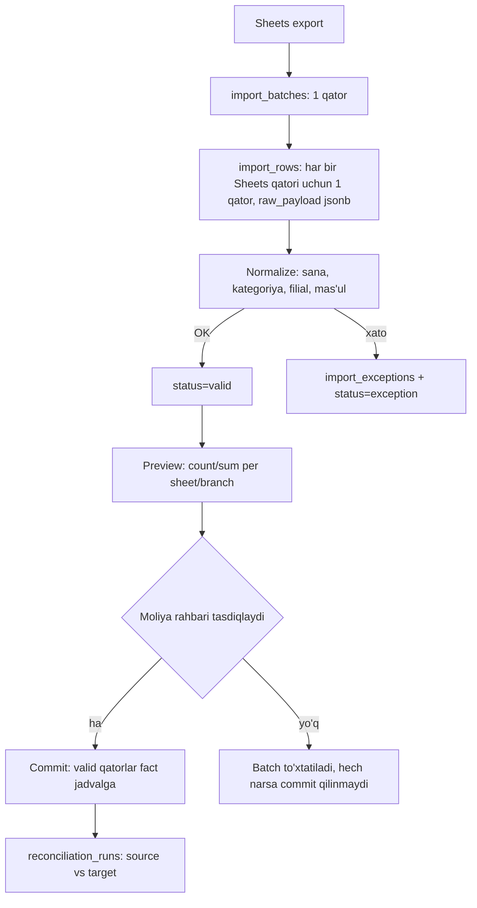

# FINCORE — Migration va operatsion qo'llanma (V1)

**Versiya:** 1.0
**Sana:** 2026-08-20
**Bog'liq hujjatlar:** `docs/DATABASE_ARCHITECTURE.md`, `docs/database/001_reference_schema.sql`..`004_verification.sql`

Bu hujjat Google Sheets manbadan FINCORE'ga migratsiya jarayonini, deployment tartibini, backup/restore siyosatini, monitoring/alertlarni va operatsion runbook'larni belgilaydi.

---

## 1. Pre-migration: backup va immutable source snapshot

1. **Original Google Sheets faylni** (`Kopiya Moliya reja`, ID `10W6K8tbQ5KjHVC2tTG8CFrBlCVnMYTp0PbPLKzUZtCc`) XLSX formatida eksport qilish va **read-only** obyekt storage'ga (masalan, S3 private bucket, versioned) yuklash.
2. Fayl `sha256` xeshini hisoblash — bu qiymat `import_batches.source_file_hash`ga yoziladi (UNIQUE constraint — bir xil fayl ikki marta import qilinmaydi, idempotent rerun kafolati).
3. Eksport paytidagi barcha 12 varaq va 5 grafikning skrinshotini/PDF nusxasini arxivlashtirish — bu **audit uchun**, import uchun emas (grafiklar parse qilinmaydi).
4. Agar production DB allaqachon mavjud bo'lsa (masalan, oldingi V0/pilot) — to'liq `pg_dump` backup migratsiyadan oldin, alohida, immutable joyga saqlanadi.
5. Ushbu bosqichning natijasi — o'zgarmas ikkita artefakt: (a) original fayl + xesh, (b) agar mavjud bo'lsa, oldingi DB holatining backup'i. Ikkalasi ham migratsiya bekor qilinsa qaytish nuqtasi bo'lib xizmat qiladi.

---

## 2. Staging-first import (to'g'ridan-to'g'ri fact insert YO'Q)

Hech qachon Sheets qatoridan to'g'ridan-to'g'ri `expenses`/`budget_lines`/`revenue_transactions`ga yozilmaydi. Har doim:



`import_rows.target_row_id` — commit qilingandan keyin tegishli fact qatorning `id`si bilan to'ldiriladi, shunda har bir imported fact o'z manba qatoriga **ikki tomonlama** kuzatiladi.

---

## 3. Canonical category/alias xaritalash

1. `002_seed_reference.sql` — 25 canonical kategoriyani (10 fixed + 15 variable) va ma'lum alias variantlarini (`category_aliases`) oldindan yuklaydi (Ilova A'dagi nomuvofiqliklar: `Terminal,server,sms` / `Terminal, server, sms`, `Bank xizmat haqi`, `Sovg'a va rag'batlantirish`, `Team building, HR`, `Gaminifikatsiya`).
2. Import normalizatsiya bosqichida har bir Sheets kategoriya matni `category_aliases.normalized_alias` bo'yicha qidiriladi (`lower(trim())` + probel/vergul siqilgan taqqoslash).
3. Agar moslik topilmasa — `import_exceptions.issue_type='unknown_master_value'`, moliya rahbari qo'lda canonical kategoriyani tanlaydi va **yangi alias** sifatida `category_aliases`ga qo'shadi (kelajakdagi importlar uchun avtomatik moslik).
4. **Hech qachon** yangi kategoriya avtomatik yaratilmaydi import paytida — faqat mavjud 25 tadan biriga xaritalanadi yoki exception sifatida qoladi (`master_data.manage` huquqiga ega odam qo'lda yangi kategoriya yaratishi mumkin, lekin bu alohida, ataylab bosqich).

---

## 4. Typed date normalizatsiya (raw qiymat saqlangan holda)

`Xalqlar_kassa`dagi 43 ta matn-sana qatori (`15.08.2026` uslubida) — bosh og'riq manbai (§9.1, TZ). Jarayon:

1. `raw_payload jsonb` — Sheets'dan kelgan **xom** qiymatni o'zgarishsiz saqlaydi (masalan, `{"date_raw": "15.08.2026", ...}`).
2. Normalizatsiya skripti (backend, DB emas — parsing logikasi ilova qatlamida, chunki turli format evristikasi kerak) `dd.mm.yyyy` uslubidagi matnni haqiqiy sanaga aylantirishga urinadi.
3. Agar parse **muvaffaqiyatli** bo'lsa — `import_rows.normalized_payload` to'ldiriladi, `status='valid'`, va bu sana keyinchalik `expenses.transaction_date`ga (haqiqiy `DATE` turi) yoziladi.
4. Agar parse **muvaffaqiyatsiz** yoki noaniq bo'lsa (masalan, yil `20269` kabi) — `import_exceptions.issue_type='invalid_date'` yoki `'wrong_year'`, `raw_payload` o'zgarishsiz qoladi, moliya rahbari qo'lda ko'rib chiqadi.
5. **Muhim qoida (DQ-01):** `expenses.transaction_date` ustuni `DATE` turida — matn sana hech qachon bu ustunga to'g'ridan-to'g'ri yozilmaydi (PostgreSQL cast xatosi bilan rad etiladi, `004_verification.sql` AC-02 buni tekshiradi). Demak, "normalize qilinmagan matn sana" **strukturaviy jihatdan** fact jadvalga tusha olmaydi — bu faqat protsedura emas, DB kafolati.

---

## 5. Validatsiya va exception routing

Har bir import qatori quyidagi tekshiruvlardan o'tadi (natija — `import_exceptions.issue_type`):

| Tekshiruv | `issue_type` | Severity |
|---|---|---|
| Sana parse bo'lmadi | `invalid_date` | error |
| Kategoriya (alias orqali ham) topilmadi | `unknown_category` yoki `unknown_master_value` | error |
| Bo'lim bo'sh | `missing_department` | error |
| Mas'ul bo'sh yoki noaniq | `missing_responsible` | warning (agar boshqa hamma narsa OK bo'lsa, qo'lda tayinlash mumkin) |
| Yil transaction sanasiga mos kelmaydi (`20269` kabi) | `wrong_year` | error |
| Filial mos kelmaydi (masalan, Sayxun varag'ida Xalqlar yozuvi) | `branch_mismatch` | error |
| Duplicate nomzod (sana+summa+filial+kategoriya+izoh+manba xeshi mos) | `duplicate_candidate` | warning — **avtomatik o'chirilmaydi**, review flag |
| Tushum uchun kassir/to'lov usuli aniqlanmagan | `missing_cashier` / `missing_payment_method` | error |
| Bank reference takrorlangan | `duplicate_external_reference` | error |
| Boshqa | `other` | warning |

`error` — commit bosqichida bloklaydi (qator fact jadvalga o'tmaydi, hal qilinmaguncha). `warning` — moliya rahbari qaroriga ko'ra o'tkazib yuborilishi yoki hal qilinishi mumkin, lekin **har doim ko'rinadi** (DQ-05).

---

## 6. Preview: sheet/branch bo'yicha count/summalar

Commit'dan oldin ilova quyidagi preview'ni ko'rsatadi (barcha `import_rows` ustida agregatsiya, hali fact jadvalga tegmaydi):

```sql
SELECT source_sheet,
       count(*) FILTER (WHERE status = 'valid')     AS valid_count,
       count(*) FILTER (WHERE status = 'exception')  AS exception_count,
       sum((normalized_payload->>'amount_uzs')::bigint) FILTER (WHERE status = 'valid') AS valid_sum_uzs
FROM fincore.import_rows
WHERE batch_id = :batch_id
GROUP BY source_sheet
ORDER BY source_sheet;
```

Bu — `Sayxun` va `Xalqlar do'stligi` uchun alohida count/sum ko'rsatadi (§10.3 TZ qabul mezoni: "Sayxun va Xalqlar kassa satrlari yo'qolmasdan alohida count/sum bilan import qilinadi").

---

## 7. Approval/commit bosqichi

1. **Moliya rahbari** preview'ni ko'rib chiqadi, `import_batches.status = 'previewing' → 'approved_for_commit'` (permission: `import.run`).
2. **Direktor** (ixtiyoriy, product owner qaroriga ko'ra) yakuniy tasdig'ini beradi — TZ 10.2: "direktor yakuniy importni tasdiqlashi mumkin".
3. Commit — background job (`fincore_service` roli, BYPASSRLS) tomonidan bajariladi: har bir `status='valid'` qator uchun **alohida tranzaksiyada** tegishli fact jadvalga INSERT, `import_rows.target_row_id` to'ldiriladi, `status='committed'`.
4. Bitta qatorning kutilmagan xatosi (masalan, FK bузилиши) **butun batchni to'xtatmaydi** — u alohida `import_exceptions`ga tushadi, qolgan qatorlar davom etadi (partial-failure strategiyasi).

---

## 8. Post-import reconciliation

Har bir commit'dan so'ng, avtomatik:

```sql
INSERT INTO fincore.reconciliation_runs (run_type, scope_type, scope_id, source_count, source_sum, target_count, target_sum, status, created_by)
SELECT 'import', 'batch', :batch_id,
       (SELECT count(*) FROM fincore.import_rows WHERE batch_id = :batch_id),
       (SELECT sum((raw_payload->>'amount_uzs')::bigint) FROM fincore.import_rows WHERE batch_id = :batch_id),
       (SELECT count(*) FROM fincore.import_rows WHERE batch_id = :batch_id AND status = 'committed'),
       (SELECT sum(amount_uzs) FROM fincore.expenses WHERE import_batch_id = :batch_id),
       CASE WHEN <source = target> THEN 'match' ELSE 'mismatch' END,
       :actor_id;
```

Agar `status = 'mismatch'` — bu **hech qachon** jim yashirin qolmaydi: Data Quality / Reconciliation reportida (TZ 5.6, ekran 5) ko'rinadi, va monitoring alert (§13) ishga tushadi. Aynan shu mexanizm orqali **6 318 400 UZS** tafovuti (Xalqlar matn-sana qatorlari) production'da ko'rinadigan bo'ladi — bu summalar hech qachon business jadvalga hardcode qilinmaydi, faqat `004_verification.sql`dagi AC-10 test fixture'ida strukturaviy tarzda takrorlanadi.

---

## 9. Idempotent rerun va rollback strategiyasi

- **Idempotent rerun:** `import_batches.source_file_hash` UNIQUE — bir xil faylni ikki marta yuklash ikkinchi urinishda darhol rad etiladi (`23505 unique_violation`), yangi batch yaratilmaydi.
- **Qisman qayta ishlash:** agar batch `failed` holatida to'xtasa, faqat `status IN ('pending','exception')` qatorlar qayta normalize/commit qilinadi — allaqachon `committed` bo'lganlar qayta ishlanmaydi (`target_row_id IS NOT NULL` tekshiruvi).
- **Rollback:** commit qilingan fact qatorlar **hech qachon** hard-delete qilinmaydi (import ham, boshqa hech narsa ham bunga imkon bermaydi). Agar butun batch xato ekanligi keyinchalik aniqlansa:
  1. Davr **ochiq** bo'lishi kerak (yopiq bo'lsa — avval `fn_reopen_period`, sabab bilan).
  2. Har bir import qilingan fact qator uchun `fn_reverse_expense`/`fn_reverse_revenue_transaction` chaqiriladi, sabab sifatida `"import batch <id> bekor qilindi"` ko'rsatiladi.
  3. `import_batches.status = 'rolled_back'`.
  4. Yangi, tuzatilgan fayl **yangi** `import_batches` qatori sifatida (yangi xesh bilan) qayta yuklanadi.

Migration schema-versiyalash uchun: har bir DDL o'zgarishi raqamli prefiks bilan (`005_`, `006_`, ...) qo'shiladi, hech qachon `001`-`004` fayllari retroaktiv o'zgartirilmaydi (production'ga tegib ketgan bo'lsa) — bu Flyway/Sqitch uslubidagi "forward-only migration" konvensiyasi.

---

## 10. Deployment tartibi

| # | Bosqich | Fayl/harakat |
|---|---|---|
| 1 | Schema, extension, domain/enum, jadval, trigger, funksiya, RLS, grant | `001_reference_schema.sql` |
| 2 | Master data seed: filial, rol, permission, kategoriya, bo'lim, to'lov usuli, sozlama | `002_seed_reference.sql` |
| 3 | Users/RBAC: real foydalanuvchilarni yaratish va `user_roles` biriktirish | Operatsion skript/admin panel — seedda **emas** (real parol/shaxs ma'lumoti) |
| 4 | Accounting periods: birinchi biznes oy(lar)ni oldindan provisioning | `SELECT fincore.fn_ensure_period(2026, 8);` yoki avtomatik (birinchi yozuvda) |
| 5 | Tarixiy import (agar kerak bo'lsa) | §1-9 jarayoni |
| 6 | Report/reconciliation view'lar | `003_report_and_reconciliation_queries.sql` |
| 7 | Policy va grant tekshiruvi | `SELECT * FROM pg_policies WHERE schemaname='fincore';` — barcha kutilgan policy mavjudligini tasdiqlash |
| 8 | Verifikatsiya (faqat **disposable** DB'da, productionda emas) | `004_verification.sql` |

**Schema-versiyalash konvensiyasi:** `NNN_qisqa_tavsif.sql`, uch xonali ketma-ket raqam, hech qachon qayta ishlatilmaydi yoki qayta tartiblanmaydi. Migration tool (Flyway/Sqitch/`node-pg-migrate` — backend tanlaydi) `schema_migrations` jadvalida qo'llanilgan versiyalarni kuzatadi.

---

## 11. Backup jadvali, restore testi, RPO/RTO tavsiyalari

| Parametr | Tavsiya |
|---|---|
| To'liq backup chastotasi | Kunlik (`pg_dump` yoki managed DB snapshot), NFR-SEC-06 minimal talabi |
| WAL-darajasidagi (PITR) backup | Yoqilgan, kamida 7 kunlik retention — RPO'ni daqiqalargacha qisqartiradi |
| **RPO (Recovery Point Objective)** | ≤ 15 daqiqa (WAL archiving yoqilgan holda) |
| **RTO (Recovery Time Objective)** | ≤ 2 soat (kichik-o'rta hajmdagi DB uchun restore + verifikatsiya) |
| Restore testi chastotasi | Oyiga kamida bir marta, alohida disposable muhitda, `004_verification.sql` restore qilingan nusxada ishga tushiriladi |
| Backup joylashuvi | Production DB'dan alohida region/hisob, kamida 30 kunlik retention |

Restore test protokoli: (1) eng so'nggi backup'ni disposable instance'ga tiklash, (2) `004_verification.sql`ni ishga tushirish — barcha AC PASSED bo'lishi shart, (3) `reconciliation_runs`dagi so'nggi 5 ta yozuvni tekshirish (`status='match'`), (4) natijani operatsion jurnalga yozish.

---

## 12. Retention va arxivlash siyosati

| Ma'lumot turi | Retention | Izoh |
|---|---|---|
| `expenses`, `revenue_transactions`, `budget_lines`, `revenue_plans` | **Doimiy** | Moliyaviy tarix, hech qachon o'chirilmaydi |
| `audit_logs` | Kamida 5 yil (mahalliy moliyaviy audit talablariga qarab uzaytiriladi) | Append-only, retention faqat arxivlashtirish (eski partition sovuq storage'ga), o'chirish emas |
| `import_rows.raw_payload` | Kamida 2 yil | Import audit uchun; keyin cold storage'ga ko'chiriladi (DB'dan emas, JSONB hajmi katta bo'lsa) |
| `reconciliation_runs` | Doimiy | Tarixiy DQ isboti sifatida — mismatch topilib, keyin tuzatilgan bo'lsa ham yozuv qoladi |
| Backup fayllari | 30-90 kun (jadvalga qarang) | Qonuniy/moliyaviy talabga ko'ra uzaytiriladi |
| `attachments` (V1.1) | Egasi (expense/revenue) tirik ekan — doimiy | Soft-delete (`is_deleted`), hard-delete yo'q |

Katta hajmli jadvallar (`expenses`, `revenue_transactions`, `audit_logs`) uchun yillik `PARTITION BY RANGE (created_at)` strategiyasi — hozircha V1 hajmida **shart emas** (§19 arxitektura hujjatida asoslangan), lekin agar yillik hajm o'nlab millionlab qatorga yetsa, keyingi migratsiya sifatida qo'shiladi (mavjud PK/unique constraint'lar partitioningga mos, chunki ular allaqachon vaqt-yo'naltirilgan ustunlarni o'z ichiga oladi).

---

## 13. Monitoring va alertlar

| Hodisa | Alert shartlari | Ta'sir darajasi |
|---|---|---|
| Failed import | `import_batches.status = 'failed'` | High — moliya rahbariga darhol xabar |
| Authorization denial ko'p soni | 5 daqiqada 10+ RLS/permission rad etish (`audit_logs.result='denied'` yoki application log) | Medium — potentsial attack yoki UI bug |
| Reconciliation mismatch | `reconciliation_runs.status='mismatch'` yaratilgan | High — moliya rahbari + direktor |
| Close failure | `fn_close_period` exception tashladi | High |
| Audit failure | `audit_logs`ga yozish muvaffaqiyatsiz (ilova log darajasida kuzatiladi, chunki DB darajasida bu deyarli imkonsiz — jadval har doim yozishga tayyor) | Critical — darhol tekshirish |
| Backup failure | Kunlik backup job muvaffaqiyatsiz tugadi | Critical |
| Applicable-revision anomaliyasi | `budget_versions`/`revenue_plans`da bir period(+branch) uchun `is_applicable=true` qatorlar soni ≠ 1 (partial unique index buzilmasligi kerak, lekin monitoring qo'shimcha tasdiq sifatida) | High (amalda deyarli imkonsiz, chunki constraint DB darajasida) |

Monitoring implementatsiyasi (Prometheus/Grafana, yoki managed DB monitoring) ilova qatlami mas'uliyati; DB bu yerda faqat **kuzatiladigan signal**larni beradi (`reconciliation_runs`, `import_batches.status`, `audit_logs.result`).

---

## 14. Operatsion runbook'lar

### 14.1 Davrni yopish (oddiy oylik jarayon)

1. Keyingi oyning 1-5 kunlari — ilova avtomatik reminder ko'rsatadi (FR-CLOSE-02, `system_settings['period_close_reminder_day_of_month']`).
2. Moliya rahbari Data Quality / Reconciliation reportini ko'rib chiqadi — ochiq exceptionlar, budjetsiz xarajatlar (FR-CLOSE-03).
3. Direktor `POST /periods/:id/close` chaqiradi → backend `fincore.fn_close_period(period_id, director_id, note)` ni chaqiradi.
4. Agar biror background yozuv davr yopilishi bilan bir vaqtga to'g'ri kelsa — u FOR SHARE/FOR UPDATE lock orqali avtomatik navbatga turadi yoki "period closed" xatosi bilan qaytadi (§21 arxitektura hujjati).
5. Muvaffaqiyatli yopilgandan so'ng — ixtiyoriy report snapshot (`report_snapshots`) yaratiladi (FR-CLOSE-07).

### 14.2 Davrni qayta ochish (favqulodda tuzatish)

1. Direktor sababni kiritadi (majburiy, bo'sh bo'lsa `fn_reopen_period` xato beradi).
2. `POST /periods/:id/reopen` → `fn_reopen_period(period_id, director_id, reason)`.
3. `period_status_events`ga yangi `'reopened'` qatori, `audit_logs`ga to'liq trace yoziladi.
4. Tuzatish (reversal + yangi to'g'ri yozuv, yoki oddiy edit) amalga oshiriladi.
5. Direktor yana `fn_close_period` chaqiradi — bu **yangi** close hodisasi, `period_status_events`da alohida qator sifatida ko'rinadi.

### 14.3 Noto'g'ri tranzaksiyani tuzatish

**Xarajat:**
1. Agar davr ochiq va status hali `reversed` emas — oddiy `PATCH /expenses/:id` orqali maydonlarni tahrirlash mumkin (audit avtomatik yoziladi).
2. Agar davr yopiq YOKI to'liq bekor qilish kerak — `POST /expenses/:id/correct` → backend `fincore.fn_reverse_expense(id, actor_id, reason)` chaqiradi (agar davr yopiq bo'lsa, avval §14.2 reopen jarayoni).
3. Kerak bo'lsa, to'g'ri qiymat bilan **yangi** xarajat yozuvi yaratiladi (eski yozuv reversed holatda audit uchun qoladi).

**Tushum:**
1. Tushum uchun oddiy edit yo'li **umuman yo'q** (§14 arxitektura hujjati) — faqat `POST /revenue-transactions/:id/reverse` → `fincore.fn_reverse_revenue_transaction(id, actor_id, reason)`.
2. Kerak bo'lsa, to'g'ri summa/kanal/kassir bilan yangi tushum tranzaksiyasi yaratiladi.
3. `revenue.reverse` — V1 seedda faqat `director`da (§ DATABASE_ARCHITECTURE.md OD-1); agar bu operatsion tiqilinch yaratsa, product owner tasdig'i bilan `finance_manager`ga kengaytirilishi mumkin — bu faqat `002_seed_reference.sql`dagi `role_permissions` INSERT ro'yxatiga bitta qator qo'shishni talab qiladi, schema o'zgarishi shart emas.

---

## 15. Xulosa

Migratsiya va operatsion model — Google Sheets'ning "formula va qat'iy diapazon"ga bog'liqligini butunlay yo'qotadi: har bir import bosqichi kuzatiladigan, qayta ishga tushiriladigan va reconciliation bilan tasdiqlanadigan; har bir production operatsiya (close/reopen/reversal) — sabab-majburiy, audit-to'liq va concurrency-xavfsiz.
