# PHASE 16 — DATABASE ARCHITECTURE

**Status:** Architecture & specification only. No application code, migrations, API endpoints, frontend components, or Figma changes were created.
**Sources read in full:** `docs/PROJECT_REQUIREMENTS.md`, `docs/PHASE_15_DEVELOPMENT_SPECIFICATION.md`, `docs/PHASE_15_1_DECISION_REGISTER.md`, `docs/PHASE_15_2_BUSINESS_DECISIONS.txt` (path changed from the originally planned `.md` — same content, located and used).

**Source-of-truth priority applied throughout:**
1. Approved business decisions (Phase 15.2, DECISION-A through E)
2. Original Excel business workflow / confirmed requirements (`PROJECT_REQUIREMENTS.md`)
3. Confirmed Figma requirements (screenshot-verified)
4. Figma-only design features
5. Architecture recommendations (this document's own judgment calls, always labeled)
6. Inference

No conflict below has been silently resolved. Where two sources disagree and no approved decision settles it, the conflict is preserved and logged in §19.

---

## SECTION 1 — PHASE 16 EXECUTIVE SUMMARY

**Architecture goal:** Design a normalized, single-tenant, PostgreSQL-class relational schema for FINCORE V1 that faithfully implements the confirmed Excel business process (2 branches, 3 roles, expense/budget management with historical integrity), while structurally accommodating — but not activating — the Figma-only features approved as "build the structure, default off" (expense approval workflow) or explicitly excluded (Student/Tuition/Refund).

**Sources used:** All four Phase 15/15.1/15.2 documents, re-read in full for this phase, per instruction.

**Approved decisions applied (all five, as fixed constraints):**
- **DECISION-A** — Branch is a dynamic, first-class entity (not an enum), seeded with 2 branches, no "add branch" admin UI required in V1.
- **DECISION-B** — Expense approval workflow is schema-supported (status/reviewer/timestamp/rejection-reason columns exist) but defaults OFF; new expenses auto-approve when the workflow is disabled.
- **DECISION-C** — Minimal revenue model only: branch × accounting period × amount. No Student/Tuition/Refund entities.
- **DECISION-D** — Extensible RBAC (users/roles/permissions/user_roles/role_permissions), seeded with exactly the 3 Excel-confirmed roles; Viewer/Administrator are structurally supportable but not seeded.
- **DECISION-E** — Decoupled SPA/API architecture, single-tenant (no `organization_id`/`tenant_id` columns), relational database.

**V1 scope:** Identity & access, branches, expense categories/departments/payment methods (reference data), expense transactions, monthly budget lines with period-locked historical integrity, minimal branch/period revenue, accounting periods with open/closed state, and the minimum technical auditability fields (`created_at`/`updated_at`/`created_by`/`updated_by`) on every mutable table.

**Excluded scope:** Student, tuition contract, individual tuition payment, refund, notifications, full business audit log, checksum/period-reopen mechanism, multi-tenancy, PWA-specific storage, generic polymorphic approval-request table, materialized views for the 6 unmatched Figma report types.

---

## SECTION 2 — DATABASE DESIGN PRINCIPLES

| Principle | Application |
|---|---|
| **Normalization** | 3NF baseline for all transactional and reference tables. One deliberate, justified denormalization: `expense_type` and `budget_lines.expense_type` are snapshotted at row-creation time from the category's type, rather than always read live via join (see §9) — this protects historical reports from silently changing if a category's type is edited later. No other denormalization is used. |
| **Historical integrity** | Enforced through `accounting_periods.status`. Once a period is `CLOSED`, its `expenses`, `budget_lines`, and `revenue_records` rows become immutable at the application/API layer (§10, §17). This directly satisfies the confirmed Excel rule "old monthly budgets must not be overwritten" (BR-07/BR-08) without inventing a versioning or audit-log system beyond what is confirmed. |
| **Branch scoping** | Every business fact (expense, budget line, revenue record) carries a mandatory `branch_id`. Access to branches is scoped per role-assignment, not per user globally (§8) — this is the one place the architecture had to resolve an ambiguity not settled by the approved decisions, and it is resolved here explicitly, not guessed. |
| **RBAC** | `users` → `user_roles` → `roles` → `role_permissions` → `permissions`, fully extensible, supporting one user holding multiple roles (required by the Excel-confirmed "Moliya rahbari + kassir" combined title, §8). |
| **Extensibility** | Every "confirmed-but-closed-list" business concept (branches, roles, categories, departments, payment methods) is a real table with rows, never a hardcoded application enum. Only strictly binary, stable technical classifications (expense type Fixed/Variable, expense/budget status) are native DB enums. |
| **Financial data safety** | Money columns are `BIGINT` (whole so'm, matching the confirmed "tiyinsiz kiritiladi" / no-sub-unit-currency rule, `PROJECT_REQUIREMENTS.md` §25), never floating point. `CHECK` constraints prevent negative amounts. |
| **Auditability (minimum)** | `created_at`, `updated_at`, `created_by`, `updated_by` on every mutable table — see §M / §13 for the explicit line between this and a full business audit log, which is **not** built here (unresolved, DECISION-11 in the register). |

---

## SECTION 3 — DOMAIN MAP

```
Identity & Access (users, roles, permissions, user_roles, role_permissions)
    ↓ (role assignments carry an optional branch scope)
Branches (branches)
    ↓ (every business fact is branch-scoped)
Reference Data (expense_categories, departments, payment_methods)
    ↓
Accounting Period (accounting_periods)  ←── governs lock/open state for everything below
    ↓                    ↓                    ↓
Expenses            Budget Lines          Revenue Records
    ↓                    ↓                    ↓
                 Reporting / Break-even (computed, no dedicated tables)
```

Approval is not a separate domain box — it is a state carried directly on `expenses` and `budget_lines` (§12), governed by a workflow-enable flag in `system_settings` (a technical-support table, not a business domain).

---

## SECTION 4 — ENTITY CATALOG

| Entity | Purpose | Source Evidence | Status |
|---|---|---|---|
| `users` | Staff accounts / login identity | Excel `Rollar` sheet (3 named staff) | CONFIRMED |
| `roles` | Named role definitions | Excel `Rollar` sheet (3 roles) | CONFIRMED |
| `permissions` | Named grantable capabilities | No source lists a formal permission catalog | APPROVED ARCHITECTURE |
| `user_roles` | User↔role assignment, optionally branch-scoped | Excel §7–9 (branch-scoped role responsibilities); DECISION-D | APPROVED ARCHITECTURE |
| `role_permissions` | Role↔permission grants | DECISION-D (extensible RBAC requirement) | APPROVED ARCHITECTURE |
| `branches` | Physical/organizational branch | Excel, all 12 sheets | CONFIRMED |
| `departments` | Expense department taxonomy | Excel `Sozlamalar` (7 departments) | CONFIRMED |
| `payment_methods` | Payment method taxonomy | Excel `Sozlamalar` (6 methods) | CONFIRMED |
| `expense_categories` | Expense category taxonomy + Fixed/Variable type | Excel `Sozlamalar` (~25 categories) | CONFIRMED |
| `accounting_periods` | Year/month period, open/closed state | Excel `Budjet_tarixi` month-block structure + monthly closing habit (§28) | CONFIRMED (structure) / APPROVED ARCHITECTURE (as an explicit entity) |
| `expenses` | Individual expense transaction | Excel `Jurnal`/cashier sheets | CONFIRMED |
| `budget_lines` | Planned amount per branch × category × period | Excel `Budjet_tarixi` | CONFIRMED |
| `revenue_records` | Minimal branch × period revenue total | DECISION-C (approved minimal scope); no Excel data | APPROVED ARCHITECTURE |
| `system_settings` | Generic key/value config (e.g., future approval threshold) | Not a business entity — scaffolding only | TECHNICAL SUPPORT ENTITY |

No entity above is labeled CONFIRMED unless a specific Excel section backs its existence as real business data. `permissions`, `user_roles`, `role_permissions`, `accounting_periods` (as an explicit table), and `system_settings` are architecture decisions made to satisfy an approved constraint — never presented as if the business asked for them by name.

---

## SECTION 5 — COMPLETE TABLE SPECIFICATIONS

Conventions used throughout: `snake_case`, plural table names, `BIGINT GENERATED ALWAYS AS IDENTITY` primary keys (see §Rationale below), `BIGINT` for money (whole so'm), `TIMESTAMPTZ` for all timestamps.

**Primary key rationale:** Surrogate `BIGINT` identity keys are used instead of UUIDs. No source confirms a distributed-systems, offline-generation, or multi-service ID-collision requirement (the confirmed scale is ~500 transactions/year across 2 branches, `PROJECT_REQUIREMENTS.md` §28) — UUIDs would be unjustified complexity here (Section 3 of the task instructions: avoid over-engineering).

---

### 5.1 `users`

| Column | Type | Nullable | Default | Constraints | Description | Source/Reason |
|---|---|---|---|---|---|---|
| id | BIGINT IDENTITY | No | — | PK | Surrogate key | — |
| phone_number | TEXT | No | — | UNIQUE | Login identifier, `+998...` format | Figma login screen `1:202`, CONFIRMED phone-based login |
| password_hash | TEXT | No | — | — | Hashed credential | Standard auth requirement |
| full_name | TEXT | No | — | — | Staff display name | Excel `Rollar` (named staff) |
| status | ENUM(`active`,`locked`,`inactive`) | No | `active` | — | Account lifecycle | BR-01 (lockout), general lifecycle |
| failed_login_attempts | SMALLINT | No | `0` | CHECK ≥ 0 | Lockout counter | BR-01: 5 attempts → 15 min lock |
| locked_until | TIMESTAMPTZ | Yes | NULL | — | Lockout expiry | BR-01 |
| must_change_password | BOOLEAN | No | `false` | — | First-login password change flag | Figma `1:629` (Parolni almashtirish, first login) — Figma-only, not Excel-confirmed, included as it's cheap and non-invasive |
| created_at | TIMESTAMPTZ | No | `now()` | — | Minimum technical auditability | §2 |
| updated_at | TIMESTAMPTZ | No | `now()` | — | " | §2 |
| created_by | BIGINT | Yes | NULL | FK → users.id | Self-referencing (nullable for the first seeded admin) | §2 |
| updated_by | BIGINT | Yes | NULL | FK → users.id | " | §2 |

**Lifecycle:** Soft-delete only (`status = inactive`); users are never hard-deleted because they are referenced by historical `expenses.entered_by`, `budget_lines.created_by`, etc. — hard deletion would orphan financial history.
**Historical integrity:** N/A directly, but protects the FK integrity of every historical row that references a user.

---

### 5.2 `roles`

| Column | Type | Nullable | Default | Constraints | Description | Source/Reason |
|---|---|---|---|---|---|---|
| id | BIGINT IDENTITY | No | — | PK | — | — |
| code | TEXT | No | — | UNIQUE | Machine key, e.g. `finance_manager`, `cashier`, `director` | Excel `Rollar` — see §8 SOURCE vs TECHNICAL terminology |
| name | TEXT | No | — | — | Display name (may carry the original Uzbek term) | Excel — "do not rename original roles silently" |
| description | TEXT | Yes | NULL | — | Free-text explanation | — |
| is_active | BOOLEAN | No | `true` | — | Soft-delete flag | §2 |
| created_at / updated_at | TIMESTAMPTZ | No | `now()` | — | — | §2 |

**Seed (V1, functional):** `finance_manager`, `cashier`, `director` — see §15.
**Structurally supported, not seeded:** `viewer`, `administrator` — insertable later with a plain `INSERT`, no migration (satisfies DECISION-D).

---

### 5.3 `permissions`

| Column | Type | Nullable | Default | Constraints | Description | Source/Reason |
|---|---|---|---|---|---|---|
| id | BIGINT IDENTITY | No | — | PK | — | — |
| code | TEXT | No | — | UNIQUE | e.g. `expense.create`, `expense.approve`, `budget.approve` | APPROVED ARCHITECTURE — no formal permission catalog is confirmed by any source; the table structure is required by DECISION-D, the exact catalog is illustrative (§8) and should be finalized in Phase 17 API design |
| description | TEXT | Yes | NULL | — | — | — |
| created_at | TIMESTAMPTZ | No | `now()` | — | — | §2 |

---

### 5.4 `role_permissions`

| Column | Type | Nullable | Default | Constraints | Description | Source/Reason |
|---|---|---|---|---|---|---|
| id | BIGINT IDENTITY | No | — | PK | — | — |
| role_id | BIGINT | No | — | FK → roles.id, ON DELETE CASCADE | — | — |
| permission_id | BIGINT | No | — | FK → permissions.id, ON DELETE CASCADE | — | — |
| created_at | TIMESTAMPTZ | No | `now()` | — | — | §2 |

**Unique constraint:** (`role_id`, `permission_id`).

---

### 5.5 `user_roles`

This is the single most load-bearing table in the RBAC/branch-access design — see §8 for the full reasoning.

| Column | Type | Nullable | Default | Constraints | Description | Source/Reason |
|---|---|---|---|---|---|---|
| id | BIGINT IDENTITY | No | — | PK | — | — |
| user_id | BIGINT | No | — | FK → users.id, ON DELETE CASCADE | — | — |
| role_id | BIGINT | No | — | FK → roles.id, ON DELETE RESTRICT | — | — |
| branch_id | BIGINT | Yes | NULL | FK → branches.id, ON DELETE RESTRICT | **NULL = this role grant applies org-wide (all branches).** Non-null = this role grant applies only within the named branch. | Resolves the Excel-confirmed Madina nuance (§8) — one user, two role rows, two different branch scopes |
| created_at | TIMESTAMPTZ | No | `now()` | — | — | §2 |

**Unique constraint:** (`user_id`, `role_id`, `branch_id`) with a partial unique index on (`user_id`, `role_id`) WHERE `branch_id IS NULL` to prevent duplicate org-wide grants of the same role to the same user (standard NULLs-are-distinct caveat, flagged for Phase 17 implementation).
**Lifecycle:** Hard-deletable (removing a role assignment is a normal admin action, not a historical financial fact) — this table is access-control state, not a financial record.

---

### 5.6 `branches`

| Column | Type | Nullable | Default | Constraints | Description | Source/Reason |
|---|---|---|---|---|---|---|
| id | BIGINT IDENTITY | No | — | PK | — | — |
| code | TEXT | No | — | UNIQUE | Machine key, e.g. `sayxun`, `xalqlar-dostligi` | Excel — 2 confirmed branches |
| name | TEXT | No | — | — | Display name | Excel |
| is_active | BOOLEAN | No | `true` | — | Soft-delete/deactivation, not a real Excel feature but cheap and matches "resistant to accidental historical data loss" | §2 |
| created_at / updated_at | TIMESTAMPTZ | No | `now()` | — | — | §2 |

**Seed (V1):** Sayxun, Xalqlar do'stligi — see §15. **Not hardcoded** — DECISION-A explicitly requires this; no enum exists anywhere in the schema for branch identity. No "add branch" admin endpoint is required in V1, but nothing in the schema prevents a future `INSERT INTO branches` without a migration.

---

### 5.7 `departments`

| Column | Type | Nullable | Default | Constraints | Description | Source/Reason |
|---|---|---|---|---|---|---|
| id | BIGINT IDENTITY | No | — | PK | — | — |
| code | TEXT | No | — | UNIQUE | — | Excel `Sozlamalar` — 7 confirmed departments |
| name | TEXT | No | — | — | — | " |
| is_active | BOOLEAN | No | `true` | — | Business-managed reference data, must be extensible, not a code enum | §2, task §E |

---

### 5.8 `payment_methods`

| Column | Type | Nullable | Default | Constraints | Description | Source/Reason |
|---|---|---|---|---|---|---|
| id | BIGINT IDENTITY | No | — | PK | — | — |
| code | TEXT | No | — | UNIQUE | — | Excel `Sozlamalar` — 6 confirmed methods |
| name | TEXT | No | — | — | — | " |
| is_active | BOOLEAN | No | `true` | — | — | — |

**Seed (V1):** The 6 Excel-confirmed methods only. **"Uzum Bank" is explicitly NOT seeded** — it is Figma-only (Income list `1:2331`), not confirmed against Excel's canonical list (CONFLICT-E2). The table is a plain lookup table, so adding it later is a one-row `INSERT`, not a schema change — extensibility is preserved without silently adopting an unconfirmed value (§15, §19).

---

### 5.9 `expense_categories`

| Column | Type | Nullable | Default | Constraints | Description | Source/Reason |
|---|---|---|---|---|---|---|
| id | BIGINT IDENTITY | No | — | PK | — | — |
| code | TEXT | No | — | UNIQUE | — | Excel `Sozlamalar` — ~25 confirmed categories |
| name | TEXT | No | — | — | — | " |
| type | ENUM(`fixed`,`variable`) | No | — | — | **Static property of the category**, not chosen per transaction | BR-12 (`PROJECT_REQUIREMENTS.md` §29 item 12); modeled as a native enum, not a separate 2-row lookup table — see reasoning below |
| is_active | BOOLEAN | No | `true` | — | — | — |
| created_at / updated_at | TIMESTAMPTZ | No | `now()` | — | — | §2 |

**Why `type` is an enum column here, not a separate `expense_types` table (task §F requires this analysis):** Fixed/Variable is a closed, stable, 2-value business classification confirmed everywhere in the Excel with no evidence it will ever gain a 3rd value or per-value attributes — unlike categories, departments, and payment methods, which are genuinely open, business-managed, growing lists ("new categories must be registered in Sozlamalar first," §25). A lookup table for a strictly binary, structurally stable concept would be the kind of unnecessary generic table the task instructions explicitly warn against (§3: "avoid unnecessary generic tables").

**Historical classification preservation (task §F requires this analysis):** If a category's `type` is edited after expenses/budget lines have been recorded against it, a live join would silently reclassify all historical rows in Fixed/Variable reports and break-even calculations. Since Excel gives no evidence categories are ever reclassified, but financial-history integrity is a stated design principle (§2), `expenses.expense_type` and `budget_lines.expense_type` are **snapshotted at row-creation time** from the category's `type` (see §5.11, §5.12) — a deliberate, narrow denormalization, not a default pattern.

---

### 5.10 `accounting_periods`

| Column | Type | Nullable | Default | Constraints | Description | Source/Reason |
|---|---|---|---|---|---|---|
| id | BIGINT IDENTITY | No | — | PK | — | — |
| year | SMALLINT | No | — | — | — | Excel `Budjet_tarixi` (24 sequential month blocks, Jan 2026–Dec 2027) |
| month | SMALLINT | No | — | CHECK BETWEEN 1 AND 12 | — | " |
| status | ENUM(`open`,`closed`) | No | `open` | — | Governs historical lock (§10, §13) | Excel §17–18 (budget history preservation) + §28 (monthly closing habit) |
| closed_at | TIMESTAMPTZ | Yes | NULL | — | — | Figma month-closing screens `1:6791`/`1:8592` — CONFIRMED as a design-stated intent, structure only |
| closed_by | BIGINT | Yes | NULL | FK → users.id | — | " |
| created_at / updated_at | TIMESTAMPTZ | No | `now()` | — | — | §2 |

**Unique constraint:** (`year`, `month`).
**Why this entity is introduced (task §K requires justification):** Excel's `Budjet_tarixi` is structurally organized as independent monthly blocks, and the confirmed rule "old months are not touched" (§18) needs a concrete row to hang a lock state on. Without an explicit `accounting_periods` table, "is this month locked yet?" would have no single source of truth and every domain (expenses, budget, revenue) would need to duplicate month/lock logic independently. This is the one non-Excel-named entity introduced purely as APPROVED ARCHITECTURE, and it is deliberately minimal: **no general ledger, no double-entry, no invoices, no unsupported accounting standard** — exactly the open/closed flag the confirmed rule requires, nothing more.

---

### 5.11 `expenses`

| Column | Type | Nullable | Default | Constraints | Description | Source/Reason |
|---|---|---|---|---|---|---|
| id | BIGINT IDENTITY | No | — | PK | — | — |
| branch_id | BIGINT | No | — | FK → branches.id, ON DELETE RESTRICT | — | Excel — every expense belongs to exactly one branch |
| accounting_period_id | BIGINT | No | — | FK → accounting_periods.id, ON DELETE RESTRICT | Derived from `transaction_date` at insert time, stored for lock enforcement/reporting performance | §10 (period locking) |
| expense_category_id | BIGINT | No | — | FK → expense_categories.id, ON DELETE RESTRICT | — | Excel |
| expense_type | ENUM(`fixed`,`variable`) | No | — | — | **Snapshot** of the category's type at entry time | See §5.9 historical-integrity reasoning |
| payment_method_id | BIGINT | No | — | FK → payment_methods.id, ON DELETE RESTRICT | — | Excel |
| department_id | BIGINT | No | — | FK → departments.id, ON DELETE RESTRICT | — | Excel |
| transaction_date | DATE | No | — | — | — | Excel — manually entered; year/month derived from this |
| amount | BIGINT | No | — | CHECK > 0 | Whole so'm, no sub-unit currency | Excel §25 |
| description | TEXT | No | — | — | "What for" free text | Excel |
| responsible_label | TEXT | Yes | NULL | — | "Mas'ul" column — in practice populated with a role name, not a structured reference | Excel §15 — deliberately kept as free text, not a FK, because Excel's own actual usage is inconsistent (role name here, real name in comment) |
| comment | TEXT | Yes | NULL | — | In practice carries the actual responsible person's name | Excel §15 |
| status | ENUM(`pending`,`approved`,`rejected`) | No | `approved`* | — | *Default depends on the `expense_approval_workflow_enabled` setting — see §12 | DECISION-B |
| reviewed_by | BIGINT | Yes | NULL | FK → users.id | Set only if status transitions from `pending` | DECISION-B |
| reviewed_at | TIMESTAMPTZ | Yes | NULL | — | " | DECISION-B |
| rejection_reason | TEXT | Yes | NULL | — | Populated only when `status = rejected` | DECISION-B |
| entered_by | BIGINT | No | — | FK → users.id | The cashier who recorded the transaction | Excel |
| created_at / updated_at | TIMESTAMPTZ | No | `now()` | — | — | §2 |
| created_by / updated_by | BIGINT | Yes | NULL | FK → users.id | — | §2 |

**Check constraint:** `rejection_reason IS NOT NULL` only permitted when `status = 'rejected'` (enforced at application layer; a DB `CHECK` referencing conditional logic is possible via a trigger but is not required for V1 — documented as an implementation detail for Phase 17, not invented here as a claimed DB guarantee).
**Lifecycle:** Hard-delete permitted only while `accounting_period.status = 'open'` (correcting entry mistakes pre-close, matching the real cashier workflow). Once the period is `closed`, no UPDATE or DELETE is permitted (§10, §17) — enforced at the application/API layer.

---

### 5.12 `budget_lines`

| Column | Type | Nullable | Default | Constraints | Description | Source/Reason |
|---|---|---|---|---|---|---|
| id | BIGINT IDENTITY | No | — | PK | — | — |
| accounting_period_id | BIGINT | No | — | FK → accounting_periods.id, ON DELETE RESTRICT | — | Excel `Budjet_tarixi` |
| branch_id | BIGINT | No | — | FK → branches.id, ON DELETE RESTRICT | — | Excel — budget is per-branch |
| expense_category_id | BIGINT | No | — | FK → expense_categories.id, ON DELETE RESTRICT | — | Excel |
| expense_type | ENUM(`fixed`,`variable`) | No | — | — | Snapshot, same reasoning as §5.11 | §5.9 |
| planned_amount | BIGINT | No | `0` | CHECK ≥ 0 | Whole so'm; 0 allowed (future months are pre-provisioned but zeroed) | Excel §17 |
| comment | TEXT | Yes | NULL | — | "Izoh/sabab" — justification for the planned figure | Excel §16 (present in structure, empty in current data) |
| status | ENUM(`draft`,`approved`) | No | `draft` | — | Excel confirms budgets are expected to be `approved` by the time they appear in the record; Figma's 2-step stepper is NOT VERIFIED as a required multi-stage state — see §12 | Excel §17 (BR-09) |
| reviewed_by | BIGINT | Yes | NULL | FK → users.id | — | — |
| reviewed_at | TIMESTAMPTZ | Yes | NULL | — | — | — |
| created_at / updated_at | TIMESTAMPTZ | No | `now()` | — | — | §2 |
| created_by / updated_by | BIGINT | Yes | NULL | FK → users.id | — | §2 |

**Unique constraint:** (`accounting_period_id`, `branch_id`, `expense_category_id`) — exactly one planned line per branch × category × month, matching the Excel's one-cell-per-category-per-branch-per-month-block structure exactly.
**Historical integrity rule (task §G/§10 requires an explicit mechanism):** Once `accounting_periods.status = 'closed'` for a given period, every `budget_lines` row referencing it becomes immutable — no UPDATE or DELETE permitted (enforced at the application/API layer as the primary mechanism; a DB trigger is a recommended defense-in-depth option for Phase 17, not claimed as already built). This is the entire mechanism: **a locked snapshot via accounting-period status**, not versioning and not an append-only ledger. Versioning was considered and rejected — see §10 for the comparison.

---

### 5.13 `revenue_records`

| Column | Type | Nullable | Default | Constraints | Description | Source/Reason |
|---|---|---|---|---|---|---|
| id | BIGINT IDENTITY | No | — | PK | — | — |
| branch_id | BIGINT | No | — | FK → branches.id, ON DELETE RESTRICT | — | DECISION-C approved scope |
| accounting_period_id | BIGINT | No | — | FK → accounting_periods.id, ON DELETE RESTRICT | — | " |
| amount | BIGINT | No | `0` | CHECK ≥ 0 | Whole so'm | " |
| notes | TEXT | Yes | NULL | — | — | — |
| created_at / updated_at | TIMESTAMPTZ | No | `now()` | — | — | §2 |
| created_by / updated_by | BIGINT | Yes | NULL | FK → users.id | — | §2 |

**Unique constraint:** (`branch_id`, `accounting_period_id`) — one revenue total per branch per period. See §11 for why an aggregate, not a transaction table, was chosen.
**Lifecycle:** Same period-lock rule as `budget_lines`/`expenses`.

---

### 5.14 `system_settings`

| Column | Type | Nullable | Default | Constraints | Description | Source/Reason |
|---|---|---|---|---|---|---|
| id | BIGINT IDENTITY | No | — | PK | — | — |
| key | TEXT | No | — | UNIQUE | e.g. `expense_approval_workflow_enabled`, `expense_review_threshold_amount` | TECHNICAL SUPPORT ENTITY — generic scaffolding, not a business entity |
| value | TEXT | Yes | NULL | — | Raw value; NULL means "not yet configured" | — |
| description | TEXT | Yes | NULL | — | — | — |
| updated_at | TIMESTAMPTZ | No | `now()` | — | — | §2 |
| updated_by | BIGINT | Yes | NULL | FK → users.id | — | §2 |

**Seed (V1):** `expense_approval_workflow_enabled` = `'false'` (DECISION-B default-off requirement). `expense_review_threshold_amount` = **not seeded, value NULL** — this is the undefined "needs extra review" threshold (DECISION-07 in the register). Per instruction, its numeric value is **not invented**; the row exists only so the eventual number can be configured without a schema change. Documented as `OPEN CONFIGURATION / NOT YET DEFINED` — see §12, §19.

---

## SECTION 6 — RELATIONSHIP SPECIFICATION

**One-to-Many:**
```
Branches        1 ───< Expenses
Branches        1 ───< BudgetLines
Branches        1 ───< RevenueRecords
Branches        1 ───< UserRoles (nullable branch scope)
ExpenseCategories 1 ───< Expenses
ExpenseCategories 1 ───< BudgetLines
PaymentMethods  1 ───< Expenses
Departments     1 ───< Expenses
AccountingPeriods 1 ───< Expenses
AccountingPeriods 1 ───< BudgetLines
AccountingPeriods 1 ───< RevenueRecords
Users           1 ───< Expenses            (entered_by, reviewed_by — two distinct FKs)
Users           1 ───< BudgetLines         (created_by, reviewed_by)
Users           1 ───< UserRoles
Roles           1 ───< UserRoles
```

**Many-to-Many (via explicit join tables — no polymorphism used):**
```
Users  ── UserRoles ──  Roles          (optionally branch-scoped per assignment)
Roles  ── RolePermissions ── Permissions
```

**One-to-One:** None required by the confirmed/approved scope.

**Example format (Mermaid-relationship style):**
```
Users
1 ───────< UserRoles >─────── 1 Roles
                │
                └──── (optional) ─── Branches
```

---

## SECTION 7 — ERD

```mermaid
erDiagram
    USERS ||--o{ USER_ROLES : has
    ROLES ||--o{ USER_ROLES : "assigned via"
    BRANCHES ||--o{ USER_ROLES : "scopes (nullable)"
    ROLES ||--o{ ROLE_PERMISSIONS : grants
    PERMISSIONS ||--o{ ROLE_PERMISSIONS : "granted via"

    BRANCHES ||--o{ EXPENSES : "recorded at"
    EXPENSE_CATEGORIES ||--o{ EXPENSES : classifies
    PAYMENT_METHODS ||--o{ EXPENSES : "paid via"
    DEPARTMENTS ||--o{ EXPENSES : "attributed to"
    ACCOUNTING_PERIODS ||--o{ EXPENSES : "belongs to"
    USERS ||--o{ EXPENSES : "entered by"

    BRANCHES ||--o{ BUDGET_LINES : "planned for"
    EXPENSE_CATEGORIES ||--o{ BUDGET_LINES : classifies
    ACCOUNTING_PERIODS ||--o{ BUDGET_LINES : "locks via"
    USERS ||--o{ BUDGET_LINES : "created by"

    BRANCHES ||--o{ REVENUE_RECORDS : "recorded at"
    ACCOUNTING_PERIODS ||--o{ REVENUE_RECORDS : "belongs to"

    USERS {
        bigint id PK
        text phone_number UK
        text password_hash
        text full_name
        text status
    }
    ROLES {
        bigint id PK
        text code UK
        text name
    }
    PERMISSIONS {
        bigint id PK
        text code UK
    }
    USER_ROLES {
        bigint id PK
        bigint user_id FK
        bigint role_id FK
        bigint branch_id FK "nullable = org-wide"
    }
    ROLE_PERMISSIONS {
        bigint id PK
        bigint role_id FK
        bigint permission_id FK
    }
    BRANCHES {
        bigint id PK
        text code UK
        text name
        bool is_active
    }
    DEPARTMENTS {
        bigint id PK
        text code UK
        text name
    }
    PAYMENT_METHODS {
        bigint id PK
        text code UK
        text name
    }
    EXPENSE_CATEGORIES {
        bigint id PK
        text code UK
        text name
        text type "fixed|variable"
    }
    ACCOUNTING_PERIODS {
        bigint id PK
        smallint year
        smallint month
        text status "open|closed"
    }
    EXPENSES {
        bigint id PK
        bigint branch_id FK
        bigint accounting_period_id FK
        bigint expense_category_id FK
        text expense_type "snapshot"
        bigint payment_method_id FK
        bigint department_id FK
        date transaction_date
        bigint amount
        text status "pending|approved|rejected"
        bigint entered_by FK
    }
    BUDGET_LINES {
        bigint id PK
        bigint accounting_period_id FK
        bigint branch_id FK
        bigint expense_category_id FK
        text expense_type "snapshot"
        bigint planned_amount
        text status "draft|approved"
    }
    REVENUE_RECORDS {
        bigint id PK
        bigint branch_id FK
        bigint accounting_period_id FK
        bigint amount
    }
    SYSTEM_SETTINGS {
        bigint id PK
        text key UK
        text value
    }
```



This ERD matches §5's written schema exactly — every table and every FK above has a corresponding row in §5 (validated in §6 of the validation checklist below).

---

## SECTION 8 — RBAC & BRANCH ACCESS MODEL

**SOURCE ROLE TERMINOLOGY (verbatim from Excel, do not silently alter):**
| Excel term | Person | Branch scope (as recorded) |
|---|---|---|
| "Moliya rahbari + kassir" | Soyibjonova Madina | Budget: both branches. Sayxun_kassa entry: Sayxun only. |
| "Kassir" | Mamurova Maftuna | Xalqlar do'stligi only |
| "Direktor" | Ergashev Abdulla | Barchasi (all) |

**TECHNICAL ROLE NORMALIZATION (this document's architecture, clearly separated from the above):**
| Role code | Corresponds to | Notes |
|---|---|---|
| `finance_manager` | "Moliya rahbari" portion of Madina's title | Assignable org-wide (branch_id = NULL on the role assignment) |
| `cashier` | "Kassir" | Assignable per-branch (branch_id set on the role assignment) |
| `director` | "Direktor" | Assignable org-wide |

**Branch access derivation — explicit decision (task requires this not be guessed):** The Excel evidence shows branch scoping is **neither purely role-derived nor purely user-assigned** — it is **both, unified into a single mechanism**: each row in `user_roles` carries an optional `branch_id`. `NULL` means the grant from that role applies across all branches; a set value scopes that specific role-grant to one branch. This single mechanism reproduces every confirmed case exactly:
- **Madina** gets two `user_roles` rows: (`finance_manager`, branch_id = NULL) — her budget planning covers both branches — and (`cashier`, branch_id = Sayxun) — her expense entry is Sayxun-only. This is the direct, non-guessed resolution of the nuance in `PROJECT_REQUIREMENTS.md` §33 ("some report-level access may be broader than raw-transaction access").
- **Maftuna** gets one row: (`cashier`, branch_id = Xalqlar do'stligi).
- **Abdulla** gets one row: (`director`, branch_id = NULL) — director → all branches, satisfied without a separate "all-branch" flag or special-cased join logic.

A separate `user_branch_access` table was considered and rejected: it would duplicate what a nullable FK on `user_roles` already expresses, and would not, by itself, resolve Madina's per-role branch-scope nuance (a plain user↔branch table can't distinguish "broad for budget, narrow for cashiering").

**Multiple roles per user:** Directly supported — `user_roles` is a proper many-to-many join table with no uniqueness constraint on `user_id` alone.

**Enforcement responsibility:**
| Layer | Responsibility |
|---|---|
| **Database** | Referential integrity (FKs), `NOT NULL`/`CHECK` constraints, uniqueness. Does **not** implement row-level security. |
| **API** | Primary enforcement point: on every request, resolve the caller's `user_roles` rows, check the required `permission.code` is granted by at least one role, and — for branch-scoped actions — check that either a matching `branch_id` row exists or a `branch_id = NULL` (org-wide) grant exists for a permission covering that action. |
| **Application** | UI-level hiding of unavailable actions (defense in depth, not a security boundary). |

**PostgreSQL Row-Level Security (RLS):** **Not recommended for V1.** RLS would add real operational complexity (policy definitions, session-variable plumbing for "current user") not justified at the confirmed scale (3 real users today). It is noted here only as a possible future hardening option if FINCORE scales toward the multi-tenant architecture discussed as a non-selected future path in DECISION-E — not adopted now.

---

## SECTION 9 — EXPENSE DATA MODEL

**Transaction lifecycle:** A cashier enters an expense (`entered_by`). If the approval workflow is disabled (`system_settings.expense_approval_workflow_enabled = false`, the V1 default), `status` is set to `approved` immediately at insert time — no reviewer, no review timestamp. If enabled, `status` starts `pending` and later transitions to `approved` or `rejected` via `reviewed_by`/`reviewed_at`/`rejection_reason` (§12, §18).

**Category/type relationship:** `expenses.expense_category_id` → `expense_categories`, whose `type` (Fixed/Variable) is copied into `expenses.expense_type` at creation (§5.9, §5.11 — historical-integrity snapshot, not a live join).

**Fixed vs. Variable:** Preserved exactly as confirmed (BR-04/BR-12) — a closed, structurally stable 2-value classification.

**Branch assignment:** Mandatory `branch_id` FK — every expense belongs to exactly one branch, matching Excel's confirmed relationship (§31).

**Payment method / department:** Mandatory FKs to the respective lookup tables (§5.7, §5.8).

**Responsible person:** Modeled as free text (`responsible_label`, `comment`), not a FK to `users` — see §5.11 for why (Excel's own actual usage of this field is inconsistent, and forcing it into a structured reference would invent a business rule Excel itself doesn't follow).

**Approval state:** See §12.

---

## SECTION 10 — BUDGET DATA MODEL

**Budget period:** `accounting_periods` (§5.10) — one row per year/month, shared across expenses/budget/revenue.

**Monthly budget lines:** `budget_lines` (§5.12) — one row per branch × category × period, `planned_amount` as the confirmed unit of data (Excel plans per branch, per category, per month, per year, §16).

**Branch allocation / category allocation:** Directly modeled as the two FK dimensions of `budget_lines`, matching Excel's `Budjet_tarixi` grid exactly (one cell per category per branch per month block).

**History preservation / locking strategy — how FINCORE guarantees old budgets are never overwritten:**

Three strategies were compared, as instructed:

| Strategy | Description | Verdict |
|---|---|---|
| **A. Locked snapshot via period status (chosen)** | `accounting_periods.status` flips `open → closed`. While `open`, a budget line can be edited freely (matching the real workflow — Madina fills in the current month's yellow cells). Once `closed`, the application/API layer refuses any UPDATE/DELETE against `budget_lines` (and `expenses`, `revenue_records`) rows tied to that period. | **Selected.** Directly and minimally satisfies the confirmed rule ("don't change old months") with the smallest possible schema footprint. No source confirms a need to track *what an edit changed* before closing — only that *closed* months must not change. |
| **B. Full row versioning** (every edit creates a new version row, old versions retained) | Gives a complete edit history even within an open period. | **Rejected for V1** — not confirmed as a requirement anywhere; Excel's own instruction is "don't touch old months," not "track every edit to the current month." Would be inventing scope beyond what's evidenced (task §3: avoid over-engineering). |
| **C. Append-only ledger (never UPDATE, only INSERT compensating rows)** | Strongest immutability, most complex query logic (must always resolve "latest" row). | **Rejected for V1** — same reasoning as B, plus materially more complex reporting queries for no confirmed benefit at this scale. |

**The exact mechanism (task requires this to be explicit):** `accounting_periods.status = 'closed'` is the single gate. All three fact tables (`expenses`, `budget_lines`, `revenue_records`) check this same flag before permitting a write. This is enforced at the API layer as the primary mechanism (§8); a database trigger enforcing the same rule is a documented, recommended, but not mandatory Phase 17 hardening option — not claimed as already implemented here.

---

## SECTION 11 — REVENUE DATA MODEL

**Approved minimal scope only** (DECISION-C, Option C-equivalent within the approved options): branch × accounting period × amount.

**Monthly aggregate vs. generic transaction structure — compared as instructed:**

| Option | Description | Verdict |
|---|---|---|
| **Monthly revenue aggregate (chosen)** | One `revenue_records` row per branch per period, a single `amount`. | **Selected.** Matches the approved scope precisely ("branch, accounting period/month, revenue amount" — nothing more). Trivially feeds break-even and monthly reporting. |
| **Generic revenue transaction structure** (many line-item rows per month, like `expenses`) | Multiple revenue entries per period, rolled up for reporting. | **Rejected.** Zero Excel evidence revenue is ever tracked as discrete transactions (Excel has no revenue data at all). Figma's Income list (`1:2331`) *is* transaction-level, but it is explicitly per-student/per-payment — building transaction-level revenue here would silently re-introduce the Student/Payment granularity that DECISION-C explicitly excluded. |

**Explicitly excluded entities (per DECISION-C, restated for this section as instructed):**
- Student
- Tuition Contract
- Individual Tuition Payment
- Refund

None of these exist anywhere in this schema.

---

## SECTION 12 — APPROVAL DATA MODEL

**Architecture chosen: Option 1 — approval fields directly on `expenses` and `budget_lines`.** Compared against the two alternatives, as instructed:

| Option | Verdict |
|---|---|
| **1. Fields directly on the domain table (chosen)** | Both approvable domains (`expenses`, `budget_lines`) already need a `status`-shaped field regardless of workflow-enabled state (Excel confirms budgets carry an "approved" label, BR-09). Adding `reviewed_by`/`reviewed_at`/`rejection_reason` alongside costs nothing extra and needs no join. |
| **2. Generic polymorphic `approval_requests` table** | Rejected — only two known target types exist in the approved scope; a polymorphic table is the exact kind of "technically interesting but unjustified" pattern the task instructions warn against (§3, §J: "Do not use polymorphic architecture only because it is technically interesting"). Figma's shared approval-queue UI (`1:4100`, tabbed Xarajatlar/Budjetlar) can be built at the **API layer** as a union query over the two tables — it does not require a shared table. |
| **3. Separate approval-record table per domain** (`expense_approvals`, `budget_approvals`) | Rejected — adds a join for no benefit over Option 1 when there are only 5–6 approval-relevant columns total; Option 1 is strictly simpler for the same guarantees. |

**Workflow-disabled (V1 default) behavior:** `system_settings.expense_approval_workflow_enabled = 'false'`. When false, the API sets new `expenses.status = 'approved'` at insert time, bypassing `pending` entirely — "logically enters an approved state," exactly as instructed. `budget_lines.status` similarly defaults to the Excel-confirmed 2-state model (`draft` → `approved`) independent of this flag, since budget approval is Excel-confirmed as a real (if informally enforced) concept, unlike expense approval which is confirmed **absent** today (CONFLICT-E4).

**Future workflow enablement:** Flipping `system_settings.expense_approval_workflow_enabled` to `'true'` changes only application logic (new expenses start `pending` instead of `approved`) — **no schema migration required**, satisfying DECISION-B's explicit constraint.

**Threshold configuration — explicitly NOT invented:** `system_settings` contains a row keyed `expense_review_threshold_amount` with `value = NULL`. This is documented as:

> **OPEN CONFIGURATION / NOT YET DEFINED.** The Figma approval queue (`1:4100`) shows a threshold-triggered "needs extra review" flag, but no source states the numeric value (DECISION-07, register). The architecture provides the storage location; the value itself is a product decision outside this phase's scope.

---

## SECTION 13 — ACCOUNTING PERIOD & MONTHLY CLOSING

| Item | Classification |
|---|---|
| A period exists per year/month, and old months must not be overwritten | **CONFIRMED BUSINESS RULE** (Excel §17–18) |
| `accounting_periods` as an explicit table with an `open`/`closed` status column | **TECHNICAL ARCHITECTURAL RECOMMENDATION** — the concrete mechanism chosen to satisfy the confirmed rule (§10) |
| Closing is irreversible, gated by a reconciliation checklist | **CONFIRMED (design-stated intent)** in Figma (`1:6791`, BR-07) — **not built here**: no checklist table, no reconciliation-status columns exist in this schema. Building it would require deciding the exact checklist items, which no source confirms beyond example screenshot text. Logged as OPEN in §19. |
| A closed period produces a SHA-256 checksum + actor + timestamp | **CONFIRMED (design-stated intent)** in Figma (`1:8592`, BR-08) — **not built here** per explicit instruction not to invent a checksum algorithm. `accounting_periods.closed_at`/`closed_by` capture the actor/timestamp half only; no checksum column exists. Logged as OPEN in §19. |
| Whether a closed period can ever be reopened | **NOT VERIFIED** (DECISION-10, register — internal tension between "cannot be undone" copy and the existence of an "Arxiv" screen). **Not built here** — only `open → closed` is a supported transition in this schema (§18). |

**Interaction with budget history, expenses, revenue:** All three fact tables carry `accounting_period_id` and are subject to the same lock rule (§10) — this is the sole mechanism by which "monthly closing" actually constrains the rest of the schema in V1.

---

## SECTION 14 — CALCULATIONS & DERIVED DATA

| Metric | Formula | Source | Stored or Calculated | Reason |
|---|---|---|---|---|
| Actual Expense (Fakt) | SUM(`expenses.amount`) grouped by branch/category/period | Excel `Jurnal` | **CALCULATED** | Trivial aggregate query; storing it would risk drift from the underlying transactions |
| Budget Plan (Reja) | `budget_lines.planned_amount` | Excel `Budjet_tarixi` | **STORED** | It is a direct human input, not derivable from anything else |
| Variance (Farq) | Reja − Fakt | Excel `Oylik_hisobot`, BR (§24) | **CALCULATED** | Simple subtraction of two already-available values |
| Bajarilish % (Execution) | Fakt ÷ Reja | Excel `Oylik_hisobot`, BR (§24) | **CALCULATED** | Same reasoning |
| Fixed Cost total | SUM(`expenses.amount`) WHERE `expense_type = 'fixed'` | Excel §12, §24 | **CALCULATED** | Aggregate over the snapshotted `expense_type` column |
| Variable Cost total | SUM(`expenses.amount`) WHERE `expense_type = 'variable'` | " | **CALCULATED** | " |
| Revenue | `revenue_records.amount` | DECISION-C | **STORED** | Direct input, no underlying transaction table exists in V1 |
| Break-even Sum | *(formula not confirmed by any source — see below)* | Figma `1:5368` shows a **value**, not the generating formula | **NOT VERIFIED** | The standard textbook formula (`Fixed Costs ÷ (1 − Variable Costs/Revenue)`) is a reasonable inference but is **not** literally shown in Figma or Excel — not invented here as a "confirmed" formula |
| Margin of Safety | `(Revenue − Breakeven Sum) / Revenue` | Figma `1:5368`, BR-09 | **CALCULATED (Figma-derived formula, not Excel-confirmed)** | Literal formula shown on-screen; explicitly labeled Figma-derived per instruction |

**Confirmed formulas (Excel-verified against real populated numbers):** Farq = Reja − Fakt; Bajarilish % = Fakt ÷ Reja; Doimiy xarajat ulushi % = Doimiy JAMI ÷ UMUMIY JAMI (`PROJECT_REQUIREMENTS.md` §24).
**Figma-derived, not Excel-confirmed:** Margin of Safety formula (BR-09).
**Not verified anywhere:** The Breakeven Sum's own generating formula. No formula is invented here to fill that gap — it is left explicitly open for a Phase 17/product decision.

---

## SECTION 15 — REFERENCE / SEED DATA

**Confirmed Branches** (Excel, `branches` table):
1. Sayxun
2. Xalqlar do'stligi

**Confirmed Roles** (Excel, `roles` table — functional V1 seed):
1. `finance_manager` — "Moliya rahbari"
2. `cashier` — "Kassir"
3. `director` — "Direktor"

*Figma-only, structurally supported but NOT seeded:* `viewer`, `administrator` (CONFLICT-E3 — not confirmed against Excel).

**Confirmed Expense Categories** (Excel `Sozlamalar`, `expense_categories` table):
Fixed (10): Ijara, Xodimlar oyligi, Soliq va ijtimoiy to'lovlar, Internet va aloqa, Kommunal abonent to'lovi, Dasturiy ta'minot/litsenziya, Buxgalteriya xizmati, Qo'riqlash va xavfsizlik, Terminal/server/sms, Tozalash xizmati.
Variable (15): Mentorlar oyligi, KPI va bonuslar, Marketing va reklama, Poligrafiya, Kanselyariya va o'quv materiallari, Elektr energiya, Texnika sotib olish, Texnika ta'miri, Tadbirlar, Mehmondorchilik, Transport, Xodimlarni o'qitish, Team building HR, Boshqa xarajatlar, Gaminifikatsiya.

*Internal Excel inconsistency, flagged not resolved (`PROJECT_REQUIREMENTS.md` §11):* `Budjet_tarixi`'s own template uses "Bank xizmat haqi" and "Sovg'a va rag'batlantirish" instead of "Terminal, server, sms" and "Team building HR"/"Gaminifikatsiya." **`Sozlamalar`'s list is used as the seed** (it is the sheet whose stated purpose is exactly this master list); the discrepancy is logged in §19, not silently reconciled.

**Confirmed Expense Types:** `fixed`, `variable` (native enum, §5.9 — not a seeded table).

**Confirmed Payment Methods** (Excel `Sozlamalar`, `payment_methods` table):
Naqd pul, Bank o'tkazmasi, Plastik karta (Uzcard/Humo), Click/Payme, Korporativ karta, Boshqa.

*Figma-only, NOT seeded:* "Uzum Bank" (CONFLICT-E2 — table is extensible, row insertable later without a schema change).

**Confirmed Departments** (Excel `Sozlamalar`, `departments` table):
Ma'muriyat, O'quv bo'limi, Marketing, Sotuv (ROP), Texnik ta'minot, HR, Umumiy.

No unconfirmed seed data (students, tuition types, notification templates, etc.) is included anywhere in this document.

---

## SECTION 16 — INDEXING STRATEGY

| Table | Index | Purpose |
|---|---|---|
| `expenses` | (`branch_id`, `accounting_period_id`) | Branch-scoped monthly reporting — the single most common query shape (Excel's core report pattern) |
| `expenses` | (`accounting_period_id`, `expense_category_id`) | Plan-vs-actual rollups by category |
| `expenses` | (`transaction_date`) | Date-range filtering (Expense list screen `1:1704`) |
| `expenses` | (`status`) | Approval queue lookups (`1:4100`), even while workflow is disabled (queue will simply be empty) |
| `budget_lines` | (`accounting_period_id`, `branch_id`, `expense_category_id`) | Already the unique constraint — also serves as the primary lookup index |
| `revenue_records` | (`branch_id`, `accounting_period_id`) | Already the unique constraint — also the primary lookup index |
| `user_roles` | (`user_id`) | Permission resolution on every authenticated request |
| `user_roles` | (`role_id`, `branch_id`) | "Who can act on branch X" queries |
| `accounting_periods` | (`year`, `month`) | Already the unique constraint |
| `role_permissions` | (`role_id`) | Permission resolution |

No indexes are proposed for `departments`, `payment_methods`, `expense_categories`, or `branches` beyond their unique `code` constraints — these are small (≤25-row) lookup tables scanned in full routinely; additional indexing would be unnecessary at this scale (task §3: avoid unnecessary indexes).

---

## SECTION 17 — DATA INTEGRITY & CONSTRAINTS

**Foreign key strategy:** `ON DELETE RESTRICT` on every FK from a fact table (`expenses`, `budget_lines`, `revenue_records`, `user_roles`) to a reference table (`branches`, `expense_categories`, `payment_methods`, `departments`, `accounting_periods`, `users`, `roles`) — a reference row that is in use can never be silently deleted out from under historical financial data. `ON DELETE CASCADE` only on pure join tables (`user_roles`, `role_permissions`) where the join row has no independent meaning once either side is gone.

**Unique constraints:** See each table in §5 (e.g., `branches.code`, `budget_lines`'s branch×category×period triple).

**Check constraints:** All money columns `>= 0` or `> 0` as appropriate (§5); `accounting_periods.month BETWEEN 1 AND 12`.

**Deletion strategy — soft delete vs. hard delete, justified per table (task explicitly requires this, not a blanket rule):**
| Table type | Strategy | Why |
|---|---|---|
| Reference/lookup tables (`branches`, `departments`, `payment_methods`, `expense_categories`, `roles`) | **Soft delete** (`is_active` flag) | Referenced by historical financial rows via FK; hard-deleting would orphan history or require cascading deletes into financial data, which is unacceptable |
| `users` | **Soft delete** (`status = inactive`) | Referenced as `entered_by`/`created_by`/`reviewed_by` across financial history |
| `expenses`, `budget_lines`, `revenue_records` | **Hard delete permitted only while the owning accounting period is `open`**; **no delete at all once `closed`** | Matches the real cashier workflow (mistakes are fixed by deleting/re-entering before month-end) while guaranteeing the confirmed "old months untouched" rule after closing — not a blanket soft-delete, because Excel gives no evidence a "trash" of old expense corrections needs to be retained |
| `user_roles`, `role_permissions` | **Hard delete** | Pure access-control state, not a financial record; removing a role assignment is a normal, immediate admin action |

---

## SECTION 18 — STATE MACHINES

**Expense (workflow disabled — V1 default):**
```
(created) → approved
```
No `pending` state is ever entered while `expense_approval_workflow_enabled = false`.

**Expense (workflow enabled — future, schema-ready today):**
```
pending → approved
pending → rejected
```
Transition triggers (who may approve/reject) are governed by the `expense.approve` permission (§8), not hardcoded into the schema.

**Budget line:**
```
draft → approved
```
Only this 2-state transition is built, matching Excel's confirmed model. Figma's 2-step Finance Manager → Managing Director stepper (`1:2638`) is **not** built as a multi-step state machine — it is `NOT VERIFIED` as a required mechanism beyond the single `reviewed_by`/`reviewed_at` pair already on `budget_lines`. A future multi-step chain, if confirmed, would need an additional small table (e.g., `budget_approval_steps`) — not invented here.

**Accounting period:**
```
open → closed
```
Only this transition is supported. Reopening is explicitly `NOT VERIFIED` (DECISION-10) and is not modeled.

---

## SECTION 19 — CONFLICT & OPEN ISSUE REGISTER

| Issue | Status | Impact on Database | Blocks Phase 16? | Recommended Next Phase |
|---|---|---|---|---|
| Approval review threshold value | OPEN (DECISION-07) | None — `system_settings` row exists, value undefined | **No** | Phase 17 (API/business-logic layer, once product supplies the number) |
| Final audit/checksum mechanism for period closing | OPEN (DECISION-11, register) | None — `closed_at`/`closed_by` capture actor/timestamp only; no checksum column exists | **No** | A dedicated audit-log design phase, once DECISION-11's scope (platform-wide vs. closing-only) is chosen |
| Branch count conflict (2 Excel vs. 4+ Figma) | **RESOLVED by DECISION-A** | `branches` is dynamic; 2 rows seeded | **No — resolved** | — |
| "Uzum Bank" payment method (CONFLICT-E2) | OPEN | None — `payment_methods` is a plain lookup table; row insertable anytime | **No** | Before frontend Income screens are built, if ever in scope |
| Viewer / Administrator future roles (CONFLICT-E3) | OPEN | None — `roles` table supports inserting them without migration | **No** | Whenever DECISION-D's full role scope is revisited |
| PWA scope | OPEN (DECISION-04, register) | None — no PWA-specific tables exist or are needed at the DB layer | **No** | Frontend/build-tooling phase |
| Prototype scope verification | OPEN (DECISION-05, register) | None — navigation flow doesn't affect schema | **No** | Frontend/UX phase |
| Shell/branding inconsistency (DECISION-01, register) | OPEN | None — purely presentational | **No** | Frontend phase |
| Report screen scope (6 unmatched report types, DECISION-06) | OPEN | None in V1 — reports are computed queries over §5's tables (§14); no dedicated tables were withheld pending this decision | **No** | Reporting/API design phase |
| Period reopen path, rejection-reason requirement detail, concurrent-session enforcement (DECISION-10 remainder) | OPEN | Minimal — `rejection_reason` column already exists (nullable, usable whether required or optional); reopen is simply unbuilt, not partially built | **No** | Product/backend-policy phase |
| Sozlamalar vs. Budjet_tarixi category-list internal inconsistency | OPEN (flagged, `PROJECT_REQUIREMENTS.md` §11) | None — `Sozlamalar`'s list was used as the seed (§15); the discrepancy is documented, not silently merged | **No** | Category-management review, whenever convenient |

No issue in this table blocks table creation, relationships, or constraints as specified in §5–§7.

---

## SECTION 20 — DATABASE V1 SCOPE FREEZE

**INCLUDED IN V1** (14 tables, all specified in §5): `users`, `roles`, `permissions`, `user_roles`, `role_permissions`, `branches`, `departments`, `payment_methods`, `expense_categories`, `accounting_periods`, `expenses`, `budget_lines`, `revenue_records`, `system_settings`.

**CONDITIONALLY SUPPORTED** (schema present, feature dormant or data row withheld):
- Expense approval workflow — columns exist on `expenses`, default bypassed (§12).
- Extended roles (`viewer`, `administrator`) — `roles` table accepts them, not seeded.
- "Uzum Bank" payment method — `payment_methods` table accepts it, not seeded.
- Expense review threshold — `system_settings` row exists, value undefined.

**EXCLUDED FROM V1** (no table, no column, anywhere in this schema):
- `students`, `tuition_contracts`, `tuition_payments`, `refunds`
- `notifications` (any form)
- Full business `audit_log` table
- Checksum column(s) for period closing
- Any `organization_id`/`tenant_id` column on any table
- PWA-specific storage (install state, offline sync tokens, manifest data)
- Generic polymorphic `approval_requests` table
- Materialized views/dedicated tables for the 6 unmatched Figma report types
- General ledger, double-entry bookkeeping, invoices, or any unconfirmed accounting standard

**FUTURE EXTENSIONS** (documented as possible paths only, not built):
- Multi-tenant migration: add `organization_id` to every table + a `organizations` table, only if FINCORE is ever confirmed to be sold to multiple education centers (DECISION-E Option C, not selected).
- Full audit log table (`audit_log`: actor, timestamp, entity_type, entity_id, before/after payload) once DECISION-11 resolves.
- Accounting-period reopen workflow + checksum mechanism, once DECISION-10/checksum policy resolves.
- Budget multi-step approval chain (`budget_approval_steps`), if Figma's Finance Manager → Managing Director sequence is confirmed as a required mechanism beyond the current single-reviewer field.
- Full Income/Student/Refund domain, if DECISION-C is later revisited toward its Option A.

---

## SECTION 21 — MIGRATION ORDER

```
001  users
002  branches
003  roles
004  permissions
005  role_permissions        (needs: roles, permissions)
006  user_roles              (needs: users, roles, branches)
007  departments
008  payment_methods
009  expense_categories
010  accounting_periods
011  expenses                (needs: branches, accounting_periods, expense_categories,
                               payment_methods, departments, users)
012  budget_lines            (needs: accounting_periods, branches, expense_categories, users)
013  revenue_records         (needs: branches, accounting_periods, users)
014  system_settings         (standalone, needs: users for updated_by)
```

No migrations were generated as part of this phase, per instruction — this is the recommended ordering for Phase 17.

---

## SECTION 22 — IMPLEMENTATION READINESS

**DATABASE ARCHITECTURE STATUS: READY**

**READY FOR PHASE 17: Yes**

**BLOCKERS:** None. Every item in §19 is either (a) fully resolved by an approved decision, or (b) a configuration/business-logic detail whose absence does not prevent creating any table, column, relationship, or constraint specified in §5–§7 (the schema already has the correct shape to receive that detail later without a migration). No unrelated UI/frontend/branding issue (DECISION-01, DECISION-04, DECISION-05, DECISION-06, DECISION-14 through 20 in the register) blocks this database architecture, consistent with the instruction not to block implementation on unrelated UI issues.

---

## SECTION 6 (VALIDATION) — DATABASE DESIGN VALIDATION AUDIT

| # | Check | Result |
|---|---|---|
| 1 | Every foreign key points to an existing table | ✅ — all FKs in §5/§6 reference one of the 14 tables in §5 |
| 2 | Every table in the ERD exists in the table catalog | ✅ — 14 tables in §7 ERD match §4/§5 exactly |
| 3 | Every table in the catalog appears in the ERD | ✅ |
| 4 | Every approved decision A–E is reflected | ✅ — A: §5.6/§15; B: §5.11/§5.12/§12; C: §5.13/§11; D: §5.2–§5.5/§8; E: single-tenant, no org_id anywhere (§20) |
| 5 | No Student table exists | ✅ |
| 6 | No Tuition table exists | ✅ |
| 7 | No Refund table exists | ✅ |
| 8 | No unnecessary multi-tenancy exists | ✅ — zero `organization_id`/`tenant_id` columns |
| 9 | Branches are dynamic | ✅ — `branches` is a real FK'd table, no enum |
| 10 | Roles are extensible | ✅ — `roles` is a real table; `viewer`/`administrator` insertable without migration |
| 11 | Multiple roles per user are supported | ✅ — `user_roles` is a proper many-to-many join |
| 12 | Expense approval can remain OFF | ✅ — `system_settings.expense_approval_workflow_enabled = false` default |
| 13 | When approval is OFF, expense behavior is auto-approved | ✅ — §12, `expenses.status` defaults `approved` when disabled |
| 14 | Historical budgets cannot be accidentally overwritten | ✅ — §10 period-lock mechanism |
| 15 | Previous months remain historically accurate | ✅ — same mechanism, plus `expense_type`/category snapshot (§5.9) prevents retroactive reclassification |
| 16 | Reporting can calculate branch-level and combined views | ✅ — every fact table carries `branch_id`; combined view = omit the branch filter (§14) |
| 17 | Revenue supports break-even calculations | ✅ — `revenue_records` + Fixed/Variable expense aggregates (§14); Breakeven Sum formula itself explicitly left `NOT VERIFIED`, not invented |
| 18 | No unsupported accounting/general-ledger system introduced | ✅ — confirmed in §13, §20 |
| 19 | All unresolved assumptions are explicitly marked | ✅ — §19 |
| 20 | Design is realistic for FINCORE's actual confirmed scale | ✅ — surrogate bigint keys, no RLS, no microservices, no polymorphism (§2, §8, §12) |

---

*End of PHASE_16_DATABASE_ARCHITECTURE.md. No application code, migration, API endpoint, or frontend component was created. No conflict was silently resolved. No entity or business rule was invented beyond what is traced to a confirmed source or an approved Phase 15.2 decision. PHASE 17 has not been started.*
